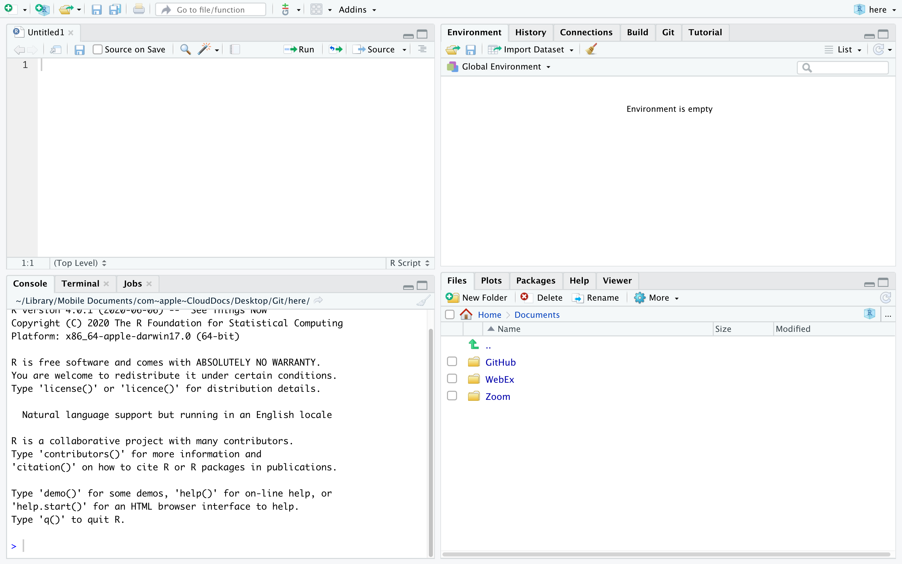

# Introduction to R

This section was written primarily by @Desharnais2020, and was modified for our course.  I am grateful for his help.


## The **RStudio** Interface 

We will begin by looking at the RStudio software interface. Refer to Figure 1 as you follow the instructions below.


```{r, echo = F, message=FALSE, warning=FALSE}
library(knitr)

```


Launch RStudio. You will see a window that looks like the figure above. There are four panels of the window:

  - The R Command Console is where you type R commands for immediate execution.

  - The Notebook in the upper left portion of the window is an area for editing R source code for scripts and functions and for viewing R data frame objects. New tabs will be added as new R code files and data objects are opened.

  - The Notebook in the upper right portion of the window is an area for browsing the variables in the R workspace environment and the R command line history.
    
   - The Notebook in the lower right portion of the window has several tabs. The Files tab is an area for browsing the files in the current working directory. The Plot tab is for viewing graphics produced using R commands. The Packages tab lists the R packages available. Other packages can be loaded. The Help tab provides access to the R documentation. The Viewer tab is for viewing local web content in the temporary session directory (not files on the web).
    
### Bottom Left Pane {-}

Let’s begin with the Console. This is where you type R commands for immediate execution. Click in the Command Console,  ">" symbol is the system prompt. You should see a blinking cursor that tells you the console is the current focus of keyboard input. Type:
```{r}
1+2
```

The result tells you that the line begins with the first (and only) element of the result which is the number 3. You can also execute R’s built-in functions (or functions you add).  Type the following command. 
```{r}
exp(pi)
```
    
    
In R, "pi" is a special constant to represent the number  and "exp" is the exponential function. The result tells you that the first (and only) element of the result is the number $e^{\pi}=$ 23.14069.

### Bottom Right Pane {-}

Now let’s look at the *Files* tab of the notebook at the lower right of the window. Every R session has a working directory where R looks for and saves files. It is a good practice to create a different directory for every project and make that directory the working directory. For example, let’s make a new directory called *MyDirectory*. (You can chose another name if you wish). 

1) Click on the **Files** tab of the notebook. You should see a listing of files in your default working directory.

2) Click on the small button with an ellipsis image on the right side of the file path above the directory listing.

3) Navigate to the folder where you want to create the new directory and click the **OK** button.

4) Click on the **New Folder** button just below the Files tab (see right).

5) Type **MyDirectory** in the panel that opens click on the folder in the Notebook.

6) Click the **More** button to the right of the New Folder button and select the menu option **Set as Working Directory**. This new folder is now the working directory for the current R session. This menu option is a short cut for a command that was automatically entered into the R console.

### Top Right Pane {-}
 Next we will look at the *R environment*, also called the *R workspace*. This is where you can see the names and other information on the variables that were created during your `R` session and are available for use in other commands.

In the `R` console type: 

```{r}
a = 29.325
b = log(a)
c = a/b
```

Look at the Environment pane. The variables `a`, `b`, and `c` are now part of your R work space. You can reuse those variables as part of other commands.

In the `R` console type: 
```{r}
v= c(a, b, c)
v
```

The variable `v` is a vector created using the *concatenate* function `c()`. (The concatenate should not be confused with the variable c that was created earlier. Functions are always followed by parentheses that contain the function arguments.) This function combines its arguments into a vector or list. Look at the Environment panel. The text `num [1:3]` tells us that the variable `v` is a vector with elements `v[1]`, `v[2]`, and `v[3]`.

### Top Left Pane {-}

Now let’s look at the `R` viewer notebook. This panel can be used to data which are data frame objects or *matrix objects* in `R`.

We will begin by taking advantage of a data frame object that was built into `R` for demonstration purposes. We will copy it into a data frame object. In the `R` console, type:

```{r}
df = mtcars
```

Let's view the data. On the right side of the entry for the `df` object is a button we can use to view the entries of the data frame (see green arrow below). Click on the View Button. 

If your look in the notebook area in the upper left portion of the window, you can see a spreadsheet-like view of the data. This is for viewing only; you cannot edit the data. Use the scroll bars to view the data entries.

You can also list the data in the console by typing the name of the data fame object:

```{r}
df
```

The columns are labeled with the names of the variables and the rows are labeled with the names of each car. Each row represents the data values for one car; that is, each row is one observation.

## Comments 

Often times we will want to add a comment to our script document so we can remember special aspects later, and make the code easier to read and modify in the future.  To add a comment start the comment with a `#` symbol. This will make the remaining characters in a line a comment and R will not try to compile these lines. Go to the script document and type the following.  Highlight what you have typed and press "Run". 

```{r}
# This is a comment 
2+ 2

2 + 3 # Comments can also start in the middle of a line. 
```


## Operators {#operators}

An operator is a symbol that tells the compiler to preform a specific task.  There are several types of operators, some preform mathematical tasks, logical checks, and create new objects.  We will review a few of the basic operators here.  We will continue to discuss and introduce operators throughout this document. 

### Arithmetic Operators {-}

R was designed for statistical applications and as a necessity it needs to preform mathematical operations efficiently and effectively.  The first operators we discuss are a few of the basic arithmetic operations.  These are operations ismilar to that of a calculator. 

```{r}
# Addition 
2+ 3

# Subtraction 
2 - 3

# Multiplication 
2*3

# Division 
2/3

# Exponent 
2^3
```


### Relational Operators {-}

Relational operators are used to compare two values.  When using a relational operation R will return either `TRUE` or `FALSE`. 

```{r}
# Less than 
2 < 3

# Greater than 
2 > 3

# Less than or equal to 
2 <= 3

# Greater than or equal to 
2>= 3

# Not equal to 
2 != 3

# Equal to 
2 == 3
```


We can use all the same operators above if our object contains more than one element.  This will preform the above comparisons element by element. 

```{r}
v
v > 10
```

If we have two vectors of an unequal length then the checks will be preformed element-by-element but the values in the shorter vector will be *recycled*, or *repeated*.  

```{r}
w = c(10, 1)
v > w
```

R evaluated the first and third element of `v` and compared it to the first element of `w`, and the second element of `v` to the second element of `w`.  In this case, R returned a *warning* alerting you that it recycled elements.  However, R will not always do this. 

### Logical operators {-}

Logical operators are similar to relational operators.  They are used to check "AND" and "OR" events.  We have the `&` symbol which returns `TRUE` only if BOTH conditions are true.  We also have the `|` symbol which returns `TRUE` if EITHER condition is true.  

```{r}
# Check if both operations are true. 
(2 < 3) & (5 < 4)

# Check if either operation is true. 
(2 < 3) | (5 < 4)
```

We can also negate a `TRUE` or `FALSE` value using the `!` symbol. 

```{r}
# Negate an operation 
!(2<3) 
```

Like relational operators from before, if we have more than one element the logical operations will be implemented element-by-element. 

```{r}
# AND event, compared element-by-element
(v > 10) & (4 < 5) 

# OR event, compared elmeent-by-elment
(v > 10) | (4 < 5) 
```

We also have the symbols `&&` and `||` which will ensure that only the first element in an object will be compared. 

```{r}
# AND event, only check the first element
(v > 10) && (4 < 5) 

# OR event, only check the first element
(v > 10) || (4 < 5) 
```


### Assignment Operators {-}

Assignment operators are used to assign values to a new object.  There are many types of assignment operators, and they operate slightly differently.  The two most common assignment operators are `=` and `<-`.  With these operators the value to the left of the operator is the name of the new object and the value on the right is what the object is now equal to. 
 
```{r}
x = 5
x

x <- 5
x
```
 
The majority of the time we can use these two assignment operators above interchangeably, there are some exceptions though.  There are several other assignment operators which are uncommon and should only be used by advanced users, `->`, `<<-`, and `->>`. 


## Additional Resources 

- [Chapter 1 of "CRAN Intro-to-R Manual"](https://cran.r-project.org/doc/manuals/r-release/R-intro.pdf)
- Videos: 
    + [Getting Started 1 | How to Download and Install RStudio](https://ucr.yuja.com/V/Video?v=2365045&node=8476457&a=437885577&autoplay=1)
    + [Getting Started 2 | Rstudio Introduction cont'd, More Tabs Explained](https://ucr.yuja.com/V/Video?v=2368643&node=8487538&a=437248619&autoplay=1)
    