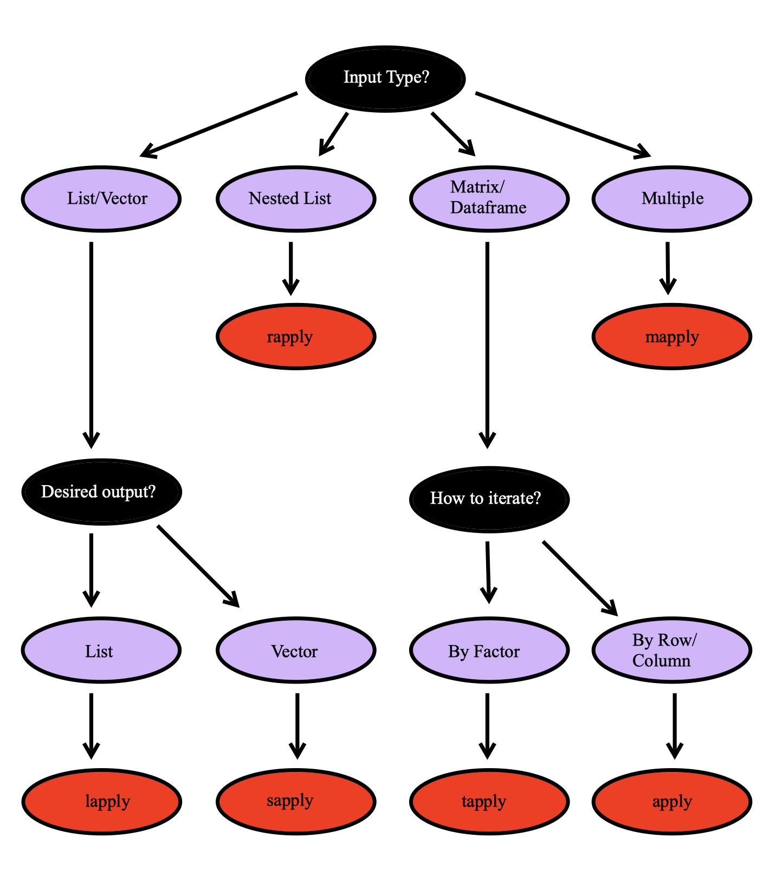

#  Apply Family of Functions {#apply}

Loops (like `for`, and `while`) are a way to repeatedly execute some code. However, they are often slow in execution when it comes to processing large data sets.

`R` has a more efficient and quick approach to perform iterations – **The apply family**.

The apply family consists of vectorized functions. Below are the most common forms of apply functions.

- `apply()`
- `lapply()`
- `sapply()`
- `tapply()`
- `mapply()`
- `replicate()`

These functions let you take data in batches and process the whole batch at once.

There primary difference is in the object (such as list, matrix, data frame etc.) on which the function is applied to and the object that will be returned from the function. 

These functions apply a function to different components of a vector/list/dataframe/array in a non-sequential way.  In general, if each element in your object is not dependent on the other elements of your object then an apply function is usually faster than a loop. 

```{r, echo = F, message=FALSE, warning=FALSE, fig.align='center', fig.width=3, fig.height=3}
library(knitr)
knitr::include_graphics("images/lapplyGraphic.png")
```


## apply() 

The `apply() `function is used to apply a function to the rows or columns of matrices or data frames. It assembles the returned values into a vector, and then returns that vector.

If you want to apply a function on a data frame, make sure that the data frame is homogeneous (i.e. either all numeric values or all character strings) Otherwise, R will force all columns to have identical types. This may not be what you want. In that case, use the `lapply()` or `sapply()` functions.

Description of the required `apply()` arguments:

- `X`: A matrix , data frame or array
- `MARGIN`: A vector giving the subscripts which the function will be applied over.
   + 1 indicates rows
   + 2 indicates columns
   + c(1, 2) indicates rows and columns
- `FUN`: The function to be applied

```{r}
# Get column means 
data = matrix(1:9, nrow=3, ncol=3)
data


apply(data, 2, mean)
```


```{r}
# Get row means 
apply(data, 1, sum)
```

You can use user-defined functions as well.

```{r}
apply(data, 2, function(x){
  
  # Standard deviation formula 
  y = sum(x -mean(x))^2/(length(x)-1)
  
  return(y)
  })
```

## lapply() 

The `lapply()` function is used to apply a function to each element of the list. It collects the returned values into a list, and then **returns that list**.

Description of the required `lapply()` arguments:

- `X`: A matrix , data frame or array
- `FUN`: The function to be applied

```{r}
data_lst = list(item1 = 1:5,
             item2 = seq(4,36,8),
             item3 = c(1,3,5,7,9))
data_lst 

data_vector = c(1,2,3,4,5,6,7,8)
data_vector


lapply(data_lst, sum)

lapply(data_vector, sum)
```


## sapply()

The `sapply()` and `lapply()` work basically the same.

The only difference is that `lapply()` always returns a list, whereas `sapply()` tries to simplify the result into a vector or matrix.

- If the return value is a list where every element is length 1, you get a vector. 

- If the return value is a list where every element is a vector of the same length (> 1), you get a matrix.

- If the lengths vary, simplification is impossible and you get a list.

Description of the required `sapply()` arguments:

- `X`: A matrix , data frame or array
- `FUN`: The function to be applied

```{r}
data_lst = list(item1 = 1:5,
                 item2 = seq(4,36,8),
                 item3 = c(1,3,5,7,9))
data_lst

sapply(data_lst, sum)
```

## tapply() 

The `tapply()` function breaks the data set up into groups and applies a function to each group.

Description of the required `sapply()` arguments:

- `X`: A matrix , data frame or array
- `INDEX`: A grouping factor or a list of factors
- `FUN`: The function to be applied

```{r}
data = data.frame(name=c("Amy","Max","Ray","Kim","Sam","Eve","Bob"), 
                  age=c(24, 22, 21, 23, 20, 24, 21),
                  gender=factor(c("F","M","M","F","M","F","M"))) 

data

tapply(data$age, data$gender, min)
```


## mapply() 

The `mapply()` function is a multivariate version of `sapply()`. It applies `FUN` to the first elements of each ... argument, the second elements, the third elements, and so on. 

Description of the required `mapply()` arguments:

- `FUN`: The function to be applied
- `...`: Arguments to vectorize over (vectors or lists of strictly positive length, or all of zero length).

```{r}
mapply(rep, times = 1:4, x = 4:1)
```


## replicate() 

The `replicate()` function is a wrapper for `sapply()`.  If we want to repeat an evaluation of an function call or an expression that does not require us to iterate through a data set or vector we can use `replicate()`.  


Description of the required `replicate()` arguments:

- `n`: 	 An integer containing the number of replications.
- `expr`: The expression (or function call) to evaluate repeatedly.


```{r}
replicate(n = 4, "Hello")

replicate(n = 10, factorial(4))

replicate(n = 5, sample(c("red", "blue")))
```


## How to Pick a Method

It can be difficult at first to decide which of these apply function you may want to use. In general, we can use the flow chart below as a quick guide. 

```{r, echo = F, message=FALSE, warning=FALSE, fig.align='center'}
library(knitr)

```


## More Examples

To see some more examples of these functions in action.  We will use the `iris` data set which is a built in data set in R. This data set has four numeric columns, and one factor column, `Species`. Each row is a flower, and there are four different measurements of each flower. 

```{r}
head(iris)
summary(iris)
```

Find the maximum value for the numeric variables for each observation. 

```{r}
numeric_iris = iris[,-5]
max_in_row = apply(numeric_iris, 1, max)
head(max_in_row)
```

Determine the (arithmetic) mean of the sepal width for each species. 

```{r}
mean_species = tapply(iris$Sepal.Width, INDEX = iris$Species, mean)
mean_species
```


Determine the (arithmetic) mean and the median of sepal width for each species. 

```{r}
my_avgs = function(vec){
  the_mean = mean(vec)
  the_median = median(vec)
  return_object=c(the_mean, the_median)
  names(return_object) = c("mean", "median")
  return(return_object)
}

species_avgs = tapply(iris$Sepal.Width, 
                      iris$Species,
                      my_avgs)
species_avgs
```


Make a plot of the sepal width and sepal length.  Make the points differ depending on the species type. 

```{r}

# Starting plot, make it blank 
plot(iris$Sepal.Length, iris$Sepal.Width, col = "white")


# Custom function to add the points
add_points = function(the_data, ...){
  
  if(the_data[5]=="setosa"){
    points(x = the_data[1], 
           y = the_data[2], 
           col = "red", 
           pch = 0)
  } else if(the_data[5]=="virginica"){
    points(x = the_data[1], 
           y = the_data[2], 
           col = "blue", 
           pch = 2)
  } else{
    points(x = the_data[1], 
           y = the_data[2], 
           col = "green", 
           pch = 10)
    
  }
} 


# Use apply to add points
apply(iris, 1, add_points)
```

Make a plot of the sepal width and sepal length.  Make the points differ depending on the species type. Add the (arithmetic) mean of these two variables for each group. 

```{r}

# ------ PLOT FROM BEFORE
# Starting plot, make it blank 
plot(iris$Sepal.Length, iris$Sepal.Width, col = "white")
apply(iris, 1, add_points)
# ------ 


# Split the data into a list by factor
split_iris = split(iris, f = iris$Species)

# Iterate through the list and add (black) points to the plot
lapply(split_iris, function(species_data){
  points(mean(species_data$Sepal.Length), 
         mean(species_data$Sepal.Width), 
         pch = 16) 
})

```
Lets try using another example.  Suppose we wish to use the following formula (below) with `a = Sepal.Length`, `b = Sepal.Width`, and `c = Petal.Length`. 
$$ \frac{-b + \sqrt{b^2-4ac} }{2a}$$

Now there is more efficient ways to do this in R, but lets practice how we would do it with `mapply` as an example. 


```{r}
my_formula = function(a, b, c){
  num = (-b + sqrt(b^2 + 4*a*c))
  den = 2*a
  
  answer = num/den
  return(answer)
}

formula_results = mapply(my_formula, 
                         a = iris$Sepal.Length, 
                         b = iris$Sepal.Width, 
                         c = iris$Petal.Length)
head(formula_results)
```


## Additional Resources {-}

- http://adv-r.had.co.nz/Functionals.html


