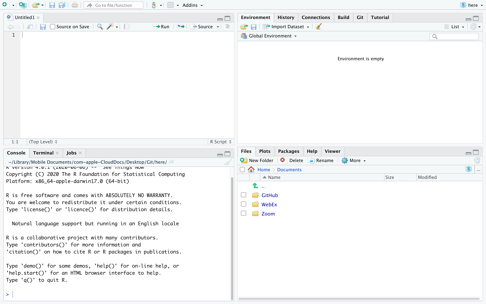

--- 
title: "STAT 107 Outline of Class Notes"
author: "Rebecca Kurtz-Garcia"
date: "`r Sys.Date()`"
site: bookdown::bookdown_site
documentclass: book
bibliography: [book.bib, packages.bib]
# url: your book url like https://bookdown.org/yihui/bookdown
# cover-image: path to the social sharing image like images/cover.jpg
description: |
  This is a minimal example of using the bookdown package to write a book.
  The HTML output format for this example is bookdown::gitbook,
  set in the _output.yml file.
link-citations: yes
github-repo: rstudio/bookdown-demo
mainfont: Arial
monofont: "Courier New"
#monotonoptions: "Scale =0.7"
---

# Welcome {-}

Welcome to STAT 107! This document will contain and outline of the course notes throughout the quarter.  Please see the course website for an approximate schedule.  In each of the chapters there will be a list of links, resources, and videos for learning more about an individual topic.  This document will be updated constantly, be sure to check here for periodic updates.  In addition, this document does not serve as a substitute for in class instruction, but more as a guide for the general content we discuss.  Students are still expected to attend every lecture.  

<!--chapter:end:index.Rmd-->

# Introduction to R

In this chapter we introduce R and RStudio, which you’ll be using throughout this course to learn how to analyze real data and come to informed conclusions. To straighten out which is which: R is the name of the programming language itself, and RStudio is a convenient interface for using R.

As the course progresses, you are encouraged to explore beyond what we discuss; a willingness to experiment will make you a much better scientist and researcher. Before we get to that stage, however, you need to build some competence in R. We begin with some of the fundamental building blocks of R and Rstudio: the interface, data types, variables, importing data, and plotting data.

R is widely used by the scientific community as a no-cost alternative to expensive commercial software packages like SPSS and MATLAB. It is both a statistical software analysis system and a programming environment for developing scientific applications. Scientists routinely make available for free R programs they have developed that might be of use to others. Hundreds of packages can be downloaded for all types of scientific computing applications. This chapter was written by the help of @Desharnais2020. 


## Download and Install R and Rstudio

To get started, you need to download both the R and Rstudio software. Both are available for free and there are versions for *Linux*, *Mac OS X*, and *Windows*. It is suggested that you download R first and then Rstudio. R can be used without RStudio, but RStudio provides a convenient user interface and programming environment for R.

The details for downloading and installing these software packages varies depending on your computer and operating system. You may need permission to install the software on your computer. The links below provide access to a mirror archive at UCLA for downloading R and the developer’s site for downloading RStudio.

- To download R, go to the url [https://ftp.osuosl.org/pub/cran](https://ftp.osuosl.org/pub/cran). Choose the binary distribution appropriate for your computer.
   + *Windows* users will want to click on the link to “Download R for Windows” and choose “install R for the first time,” then “Download R 3.5.2 for Windows.”
   + *Mac OS* users will want to click “Download R for (Mac) OS X.” Download the install package for version R-3.5.2 If you are using Mac OS X 10.9-10.10, install version R-3.3.3. If you are using OS X 10.6-10.8, install version R-3.2.1.
    + *Linux* users will want to click on the link to “Download R for Linux.” You will need to choose the version of Linux that corresponds to your installation. Versions are available for Debian, RedHat, SUSE, and Ubuntu. 

- For RStudio, use the url [https://www.rstudio.com/products/rstudio/download/](https://www.rstudio.com/products/rstudio/download/). Choose the binary distribution appropriate for your computer. Installers are provided for a variety of platforms.

- For additional help please see this video:  [Getting Started 1 | How to Download and Install RStudio](https://ucr.yuja.com/V/Video?v=2365045&node=8476457&a=437885577&autoplay=1)


## The **RStudio** Interface 

We will begin by looking at the RStudio software interface. 


```{r, echo = F, message=FALSE, warning=FALSE}
library(knitr)

```


Launch RStudio. You will see a window that looks like the figure above. There are four panels of the window:

  - The pane in the bottom left is the R Command Console is where you type R commands for immediate execution.

  - The pane in the upper left portion of the window is an area for editing R source code for scripts and functions and for viewing R data frame objects. New tabs will be added as new R code files and data objects are opened.

  - The pane in the upper right portion of the window is an area for browsing the variables in the R workspace environment and the R command line history.
    
   - The pane in the lower right portion of the window has several tabs. The Files tab is an area for browsing the files in the current working directory. The Plot tab is for viewing graphics produced using R commands. The Packages tab lists the R packages available. Other packages can be loaded. The Help tab provides access to the R documentation. The Viewer tab is for viewing local web content in the temporary session directory (not files on the web).
    
### Bottom Left Pane {-}

Let’s begin with the Console. This is where you type R commands for immediate execution. Click in the Command Console,  ">" symbol is the system prompt. You should see a blinking cursor that tells you the console is the current focus of keyboard input. Type:
```{r}
1+2
```

The result tells you that the line begins with the first (and only) element of the result which is the number 3. You can also execute R’s built-in functions (or functions you add).  Type the following command. 
```{r}
exp(pi)
```
    
    
In R, "pi" is a special constant to represent the number  and "exp" is the exponential function. The result tells you that the first (and only) element of the result is the number $e^{\pi}=$ 23.14069.

### Bottom Right Pane {-}

Now let’s look at the *Files* tab of the notebook at the lower right of the window. Every R session has a working directory where R looks for and saves files. It is a good practice to create a different directory for every project and make that directory the working directory. For example, let’s make a new directory called *MyDirectory*. (You can chose another name if you wish). 

1) Click on the **Files** tab of the notebook. You should see a listing of files in your default working directory.

2) Click on the small button with an ellipsis image on the right side of the file path above the directory listing.

3) Navigate to the folder where you want to create the new directory and click the **OK** button.

4) Click on the **New Folder** button just below the Files tab (see right).

5) Type **MyDirectory** in the panel that opens click on the folder in the Notebook.

6) Click the **More** button to the right of the New Folder button and select the menu option **Set as Working Directory**. This new folder is now the working directory for the current R session. This menu option is a short cut for a command that was automatically entered into the R console.

### Top Right Pane {-}
 Next we will look at the *R environment*, also called the *R workspace*. This is where you can see the names and other information on the variables that were created during your `R` session and are available for use in other commands.

In the `R` console type: 

```{r}
a = 29.325
b = log(a)
c = a/b
```

Look at the Environment pane. The variables `a`, `b`, and `c` are now part of your R work space. You can reuse those variables as part of other commands.

In the `R` console type: 
```{r}
v= c(a, b, c)
v
```

The variable `v` is a vector created using the *concatenate* function `c()`. (The concatenate should not be confused with the variable c that was created earlier. Functions are always followed by parentheses that contain the function arguments.) This function combines its arguments into a vector or list. Look at the Environment panel. The text `num [1:3]` tells us that the variable `v` is a vector with elements `v[1]`, `v[2]`, and `v[3]`.

### Top Left Pane {-}

Now let’s look at the `R` viewer notebook. This panel can be used to data which are data frame objects or *matrix objects* in `R`.

We will begin by taking advantage of a data frame object that was built into `R` for demonstration purposes. We will copy it into a data frame object. In the `R` console, type:

```{r}
df = mtcars
```

Let's view the data. On the right side of the entry for the `df` object is a button we can use to view the entries of the data frame. Click on the View Button. 

If your look in the notebook area in the upper left portion of the window, you can see a spreadsheet-like view of the data. This is for viewing only; you cannot edit the data. Use the scroll bars to view the data entries.

You can also list the data in the console by typing the name of the data fame object:

```{r}
df
```

The columns are labeled with the names of the variables and the rows are labeled with the names of each car. Each row represents the data values for one car; that is, each row is one observation.

## Comments 

Often times we will want to add a comment to our script document so we can remember special aspects later, and make the code easier to read and modify in the future.  To add a comment start the comment with a `#` symbol. This will make the remaining characters in a line a comment and R will not try to compile these lines. Go to the script document and type the following.  Highlight what you have typed and press "Run". 

```{r}
# This is a comment 
2+ 2

2 + 3 # Comments can also start in the middle of a line. 
```


## Operators {#operators}

An operator is a symbol that tells the compiler to preform a specific task.  There are several types of operators, some preform mathematical tasks, logical checks, and create new objects.  We will review a few of the basic operators here.  We will continue to discuss and introduce operators throughout this document. 

### Arithmetic Operators {-}

R was designed for statistical applications and as a necessity it needs to preform mathematical operations efficiently and effectively.  The first operators we discuss are a few of the basic arithmetic operations.  These are operations similar to that of a calculator. 

```{r}
# Addition 
2+ 3

# Subtraction 
2 - 3

# Multiplication 
2*3

# Division 
2/3

# Exponent 
2^3
```


### Relational Operators {-}

Relational operators are used to compare two values.  When using a relational operation R will return either `TRUE` or `FALSE`. 

```{r}
# Less than 
2 < 3

# Greater than 
2 > 3

# Less than or equal to 
2 <= 3

# Greater than or equal to 
2>= 3

# Not equal to 
2 != 3

# Equal to 
2 == 3
```


We can use all the same operators above if our object contains more than one element.  This will preform the above comparisons element by element. 

```{r}
v
v > 10
```

If we have two vectors of an unequal length then the checks will be preformed element-by-element but the values in the shorter vector will be *recycled*, or *repeated*.  

```{r}
w = c(10, 1)
v > w
```

R evaluated the first and third element of `v` and compared it to the first element of `w`, and the second element of `v` to the second element of `w`.  In this case, R returned a *warning* alerting you that it recycled elements.  However, R will not always give a warning. 

### Logical operators {-}

Logical operators are similar to relational operators.  They are used to check "AND" and "OR" events.  We have the `&` symbol which returns `TRUE` only if BOTH conditions are true.  We also have the `|` symbol which returns `TRUE` if EITHER condition is true.  

```{r}
# Check if both operations are true. 
(2 < 3) & (5 < 4)

# Check if either operation is true. 
(2 < 3) | (5 < 4)
```

We can also negate a `TRUE` or `FALSE` value using the `!` symbol. 

```{r}
# Negate an operation 
!(2<3) 
```

Like relational operators from before, if we have more than one element the logical operations will be implemented element-by-element. 

```{r}
# AND event, compared element-by-element
(v > 10) & (4 < 5) 

# OR event, compared elmeent-by-elment
(v > 10) | (4 < 5) 
```

We also have the symbols `&&` and `||` which will ensure that only the first element in an object will be compared. 

```{r}
# AND event, only check the first element
(v > 10) && (4 < 5) 

# OR event, only check the first element
(v > 10) || (4 < 5) 
```


### Assignment Operators {-}

Assignment operators are used to assign values to a new object.  There are many types of assignment operators, and they operate slightly differently.  The two most common assignment operators are `=` and `<-`.  With these operators the value to the left of the operator is the name of the new object and the value on the right is what the object is now equal to. 
 
```{r}
x = 5
x

x <- 5
x
```
 
The majority of the time we can use these two assignment operators above interchangeably, there are some exceptions though.  There are several other assignment operators which are uncommon and should only be used by advanced users, `->`, `<<-`, and `->>`. 


## Additional Resources 

- [Chapter 1 of "CRAN Intro-to-R Manual"](https://cran.r-project.org/doc/manuals/r-release/R-intro.pdf)
- Videos: 
    + [Getting Started 1 | How to Download and Install RStudio](https://ucr.yuja.com/V/Video?v=2365045&node=8476457&a=437885577&autoplay=1)
    + [Getting Started 2 | Rstudio Introduction cont'd, More Tabs Explained](https://ucr.yuja.com/V/Video?v=2368643&node=8487538&a=437248619&autoplay=1)
    

<!--chapter:end:01-intro.Rmd-->

# Introduction to R Objects  

At its core, R is an objected-oriented computational and programming environment. Everything in R is an object belonging to a certain *class*.  In this chapter we begin by discussing **atomic** objects, these are the core fundamental objects used in R.  Next we discuss vectors, lists, and matrices.  These objects are among the most common types that are used.  Lastly we discuss factors and data frames.  Factors and data frames are known as dynamic objects, and are more complex.  All of these objects have special properties and a multitude of features that we can use.  We discuss some of their key properties here, but will continue exploring and learning about their features, and introducing more object types throughout the course. 

## Atomic Objects 

R can represent different types of data. The types include `numeric`, `integer`, `complex`, `logical`, `character`, and `raw`. These are the basic fundamental objects we can use in R. For our class we will not need the `complex` type which stores complex numbers, and in practice `raw` is rarely used. We will concentrate on the remaining four types. Unlike other object-oriented languages we do not need to specify what type of object we are creating when we create it.  Instead, R guesses the type of object you are creating.  To check the object type we can use the  `class()` function.  

### Numeric {-}

Numeric objects are perhaps the most common.  These are objects which contain a real number, that is, a number which can contain a decimal value.  These objects are comparable to `doubles` in `C`. 

```{r}
a = 17.45
a
class(a)
b = 5
b 
class(b)
```

Both the variables `a` and `b` are `numeric` objects. When you type a number R will default to treating it as a `numeric` object which allows decimals. 

### Integer {-}

We can also create numeric objects which are specifically made to store integer values.  We can do this using the `as.integer()` function.

```{r}
a = as.integer(a)
a
class(a)
b = as.integer(b)
b 
class(b)
```

### Logical {-}

Logical values are either `TRUE` or `FALSE` and are created by using logical and relational operators.  In other words, they are created by using statements that compare variables. There are several ways to do logical statements as we saw in Section \@ref(operators). 

```{r}
b = 5
n = (10<11)
n
class(n)
```

We can also assign a value as `TRUE` or `FALSE` manually by setting it equal to `TRUE` or `FALSE`, or by using `T` or `F`. 

```{r}
c = T
c
class(c)
```


### Character {-}

`Character` values are text. They are often used as data values and labels. 

```{r}
first = "George"
first 
class(first)
last = "Washington"
last
class(last)
```
There are several functions that can operate on character strings.

```{r}
full = paste(first, last)
full 
nchar(full)
tolower(full)
toupper(full)
```

The function `paste()` concatenates two or more character strings with a separator, which is a space by default. The function `nchar()` returns the number of characters in a string. The functions `tolower()` and `toupper()` changes any upper case characters to lower case and vice-versa.

## Vectors

All the objects we have created this far are single element *vectors*.  R is a vectorized language, meaning most of the procedures, functions, and operations have been optimized to work with vectors. It is typically advantageous to utilize this feature.  **A vector is a collection of values of the same data type**.  We can use the concatenate function, `c()`, to create vectors, and to make a vector larger. 

```{r}
v1 = c(19, 390.3, pi, -32.1)
v1
class(v1)

v2 = c(1.1, 6, -9.4, 32.1)
v2
class(v2)

```

If we try to create a vector with a mix of classes R will convert all the objects to be the same class.  In general, it is easiest to convert objects into a `character` but hard to convert `character` into something else.  Be cautious when mixing data types and vectors because you will not be notified if objects are converted, and they may not be converted to the class you intended. 

```{r}

v3 = c(v1, first)
class(v3)

v4 = c(first, last)
class(v4)
```


The `length()` function can be used to obtain the number of elements in a vector. 

```{r}
length(v1)
```

Vectors can be used in arithmetic computations. If the two vectors are of the same length, the computations are performed element-by-element.

```{r}
v1 + v2

v1 * v2
```

Single numbers (scalars) will operate on all the vector elements in an expression. 

```{r}
5*v1

v1/3
```

Individual elements of a vector can be obtained using an index in square brackets. A negative index removes that element from the vector. The `v2[-1]` is the vector `v2` with the first element removed. The concatenate function can be used to obtain two or more elements of a vector in any desired order. Here `v1[c(3,2)]` returns the third and second elements of the vector `v1`.

```{r}
v1[3]
v2[-1]
v3[c(3,2)]
```

## Lists 

Lists are thought of as a vector with a variety of classes.  A list is made up of elements, and each element can be of a different class. 

```{r}
lst = list(4, v4, v2)
lst
class(lst)
```

We can observe the class of each element in the list by using the `str()` function. 

```{r}
str(lst)
```

The above output tells us we have a list of three objects.  The first object is a numeric vector with one element, the second object is a character vector with two elements, and third object is a numeric vector with four elements. We can subset elements in a list using double brackets we `[[]]`.  Inside these square brakets we state the element we would like to obtain. 

```{r}
lst[[1]]
class(lst[[1]])
```

To determine how long our list is we can use the `length()` function.  

```{r}
length(lst)
```

 

## Matrices

A matrix is a two dimensional array of data of **the same type**. The matrix function, `matrix()`, can be used to create a new matrix.

```{r}
m = matrix(c(1, 9, 2, 0, 5, 7, 3, 8, 4), 
           nrow=3, ncol=3)
m
```

R labels the rows and columns for us in the output. The matrix is filled column-by-column using the elements of the vector created by the concatenate function. As with vectors, matrices can be used in arithmetic operations with scalars and other matrices of the same size.

```{r}
m2 = m/2
m2
m *m2
```

Indices can be used to obtain the elements of a matrix, but now we must consider both the row and column.

```{r}
m[2,2]
m[c(1,3), c(1,3)]
m[2,]
m[,3]
```

Some functions are particularly useful when using matrices.  For instance, `t()`, `dim()`, and `c()`. The transpose function, `t()`, switches the column and rows of a matrix. The dimension function, `dim()`, returns the dimensions (number of rows, columns) of a matrix. The concatenate function, `c()`, turns a matrix into a vector by concatenating the columns of the matrix.
```{r}

# Dimensions (row, column)
dim(m)

# Transpose
t(m)

# Convert to vector 
c(m)
```


## Factors

Factors are useful for categorical data. Factors differ from character objects in that a character object is a string of characters or symbols placed in a specific order.  For example, the object `first = "George"` is a character object with six elements.  In contrast, the collection of values "George" would instead represent a distinct value, or *level*, for a factor object.  We can create a factor object using the `factor()` function. 

```{r}
colors = c("red", "blue", "red", "red", "blue")
colors = factor(colors)
colors
class(colors)
```

Here the unique elements in the factor are called "levels".  There are only two levels `red` and `blue`, and there are five elements in our factor object. We can index factors in the same way we index a list.  

```{r}
# Return first element in the factor object 
colors[1]
```


## Data Frames

Like a matrix, a data frame is a rectangular array of values where each column is a vector, However, unlike a matrix, the columns can be different data types. 

We can create a set of vectors of the same length and use the `data.frame()` function to make a data frame object.

```{r}
age = c(1, 8, 10, 30, 31)
gender = c("Female", "Female", "Male","Female","Male")
married = c(FALSE, FALSE, FALSE, TRUE, TRUE)
simpsons = data.frame(age, gender, married)
simpsons
class(simpsons)
```


Data frames can be indexed using the same techniques as was done with matrices. 

## Other Object Types and the Global Environment

There are more objects then what we have discussed above. For example, many of the advanced functions create specific objects generated by that specific function.  There are hundreds, and possibly thousands, of such objects.  These objects generally are special cases of lists, factors, and other various types of objects that we have defined in this section.  The objects we have described here are the building blocks of most values we will be working with. Functions like `class()` and `length()` are also considered as objects, but are of a different type.  We discuss functions in more detail in section \@ref(functions).  

There are also built-in, or special objects in R.  For example, the object `pi` is an object already defined. These built-in values and functions can be written over, but that is not advised.

```{r}
pi
```

Every time we create an object we see that the Global Environment tab in the top right pane updates.  The object we have created is now listed in the Global Environment. This is a collection of all *user created* objects in R, that R knows about, and that R can easily call.  Built-in objects, such as `pi`, will not be listed here. 


## Additional Resources 

- Chapters 2, 3, 4.1, 4.3, 5.1-5.3, 6 of [CRAN Intro-to-R Manual](https://cran.r-project.org/doc/manuals/r-release/R-intro.pdf)
- Videos: 
    + [Variables 1 | Types and Assignments](https://ucr.yuja.com/V/Video?v=2368642&node=8487537&a=1529691043&autoplay=1)
    + [Variables 2 | Nameing Conventions and Best Practices](https://ucr.yuja.com/V/Video?v=2368641&node=8487536&a=957339369&autoplay=1)
    + [Vectors 1 | Introduction](https://ucr.yuja.com/V/Video?v=2368859&node=8488053&a=283774152&autoplay=1)
    + [Vectors 2 | Subsetting and Modifying](https://ucr.yuja.com/V/Video?v=2368857&node=8488051&a=1465899289&autoplay=1)
    + [Vectors 3 | Vectorized Functions - Logical Comparisons](https://ucr.yuja.com/V/Video?v=2368856&node=8488050&a=612212822&autoplay=1)
    + [Matrices 1 | Introduction](https://ucr.yuja.com/V/Video?v=2368855&node=8488049&a=447596964&autoplay=1)
    + [Matrices 2 | Accessing Rows and Columns](https://ucr.yuja.com/V/Video?v=2368854&node=8488047&a=1529352108&autoplay=1)


# More on R Objects 

Factors and lists have especially unique properties that are often utilized.  In this chapter we take special care to discuss these properties. 

## Factors 

In real-world problems, you often encounter data that can be classified in categories. For example, suppose a survey was conducted of a group of seven individuals, who were asked to identify their hair color and if they own a pet.

```{r}
name = c("Amy", "Bob", "Eve", "Kim", "Max", "Ray", "Sam")
hair = c("Blonde", "Black", "Black", "Red", "Blonde", "Brown", "Black")
own_pets = c(TRUE, FALSE, TRUE, TRUE, FALSE, FALSE, FALSE)

catagorical = data.frame(name, hair, own_pets)
colnames(catagorical) = c("Name", "Hair Color", "Own Pets")

catagorical

```


Here, the hair color and pet ownership are examples of categorical data. For the hair color variable we will typically want to store it as a factor, as opposed to a character vector. The different values that the factor can take are called levels. In R, you can create a factor with the `factor()` function. 

```{r}
f = factor(hair)
f
```

A factor looks like a vector, but it has special properties. Levels are one of them. Notice that when you print the factor, R displays the distinct levels below the factor. R keeps track of all the possible values in a vector, and each value is called a level of the associated factor.The `levels()` function shows all the levels from a factor.

```{r}
levels(f)
```


If your vector contains only a subset of all the possible levels, then R will have an incomplete picture of the possible levels. Consider the following example of a vector consisting of directions:

```{r}
directions = c("North", "West", "North", "East", "North", "West", "East")
f = factor(directions)
f
```

Notice that the levels of your new factor do not contain the value “South”. So, R thinks that North, West, and East are the only possible levels. However, in practice, it makes sense to have all the possible directions as levels of your factor. To add all the possible levels explicitly, you specify the `levels` argument of the function `factor()`.

```{r}
directions = c("North", "West", "North", "East", "North", "West", "East")
f = factor(directions,
            levels = c("North", "East", "South", "West"))
f
```

R lets you assign abbreviated names for the levels. You can do this by specifying the `labels` argument of `factor()`.

```{r}
directions = c("North", "West", "South", "East", "West", "North", "South")
f = factor(directions,
            levels = c("North", "East", "South", "West"),
            labels = c("N", "E", "S", "W"))
f
```

Sometimes data has some kind of natural order between elements. For example, sports analysts use a three-point scale to determine how well a sports team is competing: 

**loss < tie < win**.

In market research, it’s very common to use a five point scale to measure perceptions: 

**strongly disagree < disagree < neutral < agree < strongly agree**.

Such kind of data that is possible to place in order or scale is known as **ordinal data**. We can store ordinal data as an ordered factor. To create an ordered factor, use the `factor()` function with the argument `ordered=TRUE`.  

```{r}
record = c("win", "tie", "loss", "tie", "loss", "win", "win")
f = factor(record, 
            ordered = TRUE)
f
```


You can also reverse the order of levels using the `rev()` function. 

```{r}
record = c("win", "tie", "loss", "tie", "loss", "win", "win")
f = factor(record, 
            ordered = TRUE, 
            levels = rev(levels(f)))
f

```


If you have no observations in one of the levels, you can drop it using the `droplevels()` function.

```{r}
record = c("win", "loss", "loss", "win", "loss", "win")
f = factor(record,
            levels = c("loss", "tie", "win"))

f

droplevels(f)

```

The `summary()` function will give you a quick overview of the contents of a factor.


```{r}
f = factor(hair)
f
summary(f)
```

The function `table()` tabulates observations.


```{r}
table(f)
```


## Lists 

A *list* is an array of objects. Unlike vectors and matrices, the elements in a list can belong to different classes. Lists are useful for packaging together a set of related objects. We can create a list of objects in our environment by using the `list()` function.

```{r}
lst = list(1, 2, 3)

# A list of characters
lst = list("red", "green", "blue")

# A list of mixed datatypes
lst = list(1, "abc", 1.23, TRUE)
```

The best way to understand the contents of a list is to use the structure function `str()`. It provides a compact display of the internal structure of a list.

```{r}
lst = list(1, "abc", 1.23, TRUE)
str(lst)
```


A list can contain sublists, which in turn can contain sublists themselves, and so on. This is known as *nested list* or *recursive vectors*.

```{r}
lst = list(1, 3, "abc", list("a","b","c"), TRUE)
str(lst)
```

There are two ways to extract elements from a list:

- Using `[[]]` gives you the element itself.
- Using `[]` gives you a list with the selected elements

You can use `[]` to extract either a single element or multiple elements from a list. However, the result will always be a list.

```{r}
# extract 2nd element
lst[2]

# extract 5th element
lst[5]

# select 1st, 3rd and 5th element
lst[c(1,3,5)]

# exclude 1st, 3rd and 5th element
lst[c(-1,-3,-5)]

```


You can use `[[]]` to extract only a single element from a list. Unlike `[]`, `[[]]` gives you the element itself.

```{r}
# extract 2nd element
lst[[2]]

# extract 5th element
lst[[5]]

```

You can’t use logical vectors or negative numbers as indices when using `[[]]`.  The difference between `[]` and `[[]]` is really important for lists, because `[[]]` returns the element itself while `[]` returns a list with the selected elements. The difference becomes clear when we inspect the structure of the output – one is a character and the other one is a list.

```{r}
lst = list("a","b","c","d","e","f")

class(lst[[1]])

class(lst[1])
```

Each list element can have a name. You can access individual element by specifying its name in double square brackets `[[]]` or use `$` operator.

```{r}
months = list(JAN=1, FEB=2, MAR=3, APR=4)

# extract element by its name
months[["MAR"]]


# same as above but using the $ operator
months$MAR


# extract multiple elements
months[c("JAN","APR")]


```

You can access individual items in a nested list by using the combination of `[[]]` or `$` operator and the `[]` operator.

```{r}
lst = list(item1 = 3.14,
            item2 = list(item2a = 5:10,
                         item2b = c("a","b","c")))

# preserve the output as a list
lst[[2]][1]


# same as above but simplify the output
lst[[2]][[1]]


# same as above with names
lst[["item2"]][["item2a"]]


# same as above with $ operator
lst$item2$item2a


# extract individual element
lst[[2]][[2]][3]


```

Modifying a list element is pretty straightforward. You use either the `[[]]` or the `$` to access that element, and simply assign a new value.

```{r}
# Modify 3rd list element
lst = list("a","b","c","d","e","f")
lst[[3]] = 1
str(lst)

```

You can modify components using `[]` as well, but you have to assign a list of components.

```{r}
# Modify 3rd list element using []
lst = list("a","b","c","d","e","f")
lst[3] = list(1)
str(lst)

```


Using `[]` allows you to modify more than one component at once.

```{r}
# Modify first three list elements
lst = list("a","b","c","d","e","f")
lst[1:3] = list(1,2,3)
str(lst)

```

You can use same method for modifying elements and adding new one. If the element is already present in the list, it is updated else, a new element is added to the list.

```{r}
# Add elements to a list
lst = list(1, 2, 3)
lst[[4]] = 4
str(lst)


```

By using `append()` method you can append one or more elements to the list.

```{r}
# Add more than one element to a list
lst = list(1, 2, 3)
lst = append(lst,c("a","b","c"))
str(lst)


```


By using a logical vector, you can remove list elements based on the condition.

```{r}
# Remove all negative list elements
lst = list(-4,-3,-2,-1,0,1,2,3,4)
lst[lst <= 0] = NULL
str(lst)
```


The `c()` does a lot more than just creating vectors. It can be used to combine lists into a new list as well.

```{r}
lst1 = list("a","b","c")
lst2 = list(1,2,3)
lst = c(lst1, lst2)
str(lst)
```

Basic statistical functions work on vectors but not on lists. For example, you cannot directly compute the mean of list of numbers. In that case, you have to flatten the list into a vector using `unlist()` first and then compute the mean of the result.

```{r}
lst = list(5, 10, 15, 20, 25)
mean(unlist(lst))
```

To find the length of a list, use `length()` function.


```{r}
length(lst)
```


<!--chapter:end:02-objects.Rmd-->

# Functions {#functions}

In R we have functions, functions are another type of object in R.  We use functions in order to preform a series of tasks repeatedly, or preform these tasks in different settings.  They can make our code much more efficient.  We can build our own functions or we can use built in functions. Here we describe both types and their properties. Parts of this chapter where adapted by @r-func and @dummies2015. 


## Build Your Own Function

 To define a function, a name is assigned and the keyword `function` is used to denote the start of the function and its argument list. Functions are created using the `function()` directive and are stored as R objects just like anything else. In particular, they are R objects of class *function*. Functions can be passed as arguments to other functions. Functions can be nested, so that you can define a function inside another function.


Below is the **general template**

```{r, eval = F}
function_name = function(arg){
  # Function Body 
  ....
  return(return_value)
}
```

In this template we have the following key components

- `function_name`: This is the actual name of the function. It is stored in R environment as an object with this name.
- `function`: A directive which tells R a function is being created. 
- `arg`:  An argument is a placeholder. When a function is invoked, you pass a value to the argument. Arguments are optional; that is, a function may contain no arguments. Also arguments can have default values.
- `function body`:  The function body contains a collection of statements that defines what the function does.
- `return_value`: The output value of the function.  If `return(return_value)` is not supplied then the return value of a function is the last expression in the function body to be evaluated. Your function can only return one object. This object can be any class of object you desire, like a vector, list or data frame, but you may only return one object.


Below is an example of converting a temperature from Fahrenheit to Celsius. 

```{r}
fahrenheit_to_celsius = function(temp_F){
  temp_C = (temp_F - 32) * 5 / 9
  return(temp_C)
}
```

In this example the function name is `fahrenheit_to_celsius`, there is only one input or argument, `temp_F`, and the output is the object `temp_C`.

Now if we would like to "call" this function we can simply put into the command console the function name and desired input.  

```{r}
# Convert 87F to Celsius
fahrenheit_to_celsius(temp_F = 87)
```


What would happen if we tried to call this function without supplying an input?  This would result in an error. 

```{r,eval=F}
# temp_F not defined. 
fahrenheit_to_celsius()
```


```
Error in fahrenheit_to_celsius() : 
  argument "temp_F" is missing, with no default
```

With functions we can define function arguments to have default values.  These default values are used only if the user did not supply an argument value. Observe the example below. 

```{r}

# An example function 
example_func = function(a = 1, b){
  c = a + b
  d = c + 1
  
  # returns a+b+1
  return(d)
}

# Call example function
example_func(a= 2, b= 3)
example_func(b = 3)
```


Further notice that R has three ways to match function inputs to the formal arguments of the function definition. R attempts to match inputs to arguements in the following order. 

1) by complete name

2) by partial name (matching on initial *n* characters of the argument name)

3) by position

After running a function command R first attempts to match arguments by complete name, then by partial name, and then by position.  If it unable to match inputs to an argument it then uses the default argument value, if one exists.

Observe: 

```{r}
example_func(2, 3)
example_func(b = 3, a = 2)
example_func(a = 2, b = 3)
```


## Lexical Scoping 

With all these examples of functions, notice that in your global environment, only the function name was added.  The function arguments, return values, and all objects defined inside the function are not a part of the global environment.  This is not a mistake.  We can define objects locally, or temporarily, when using functions.  These objects are created and used only when the function is running, and quickly discarded once the function finishes. They never are listed in the global environment.  

Sometimes you may have an object defined in multiple places.  When this happens, R uses a system of rules to determine which definition it will use. In other words, how and where we define an object determines the objects *scope*, or range of places that we can use this object. The system of rules R uses for searching for objects is called *lexical scoping*, as opposed to other types of scoping. With this system R looks for objects that are called in a function within the itself, then any enclosing environments, then the global environment, and lastly looking at objects in packages or built-in objects. This is the same searching method that we see in Python and Java.  

```{r, echo = F, message=FALSE, warning=FALSE, fig.align='center', fig.height=3}
library(knitr)
knitr::include_graphics("images/Scoping.png")
```

## Built-In Functions

R has functions built-in to it just like excel.  You can call these built-in function at any time.  We have already seen a few of these functions. 

- `c()`
- `class()`
- `matrix()`
- `data.frame()`


Below are a few more examples using the built-in dataset `mtcars`, we will use `mtcars$mpg` as a vector of data to analyze. 


* `mean()`: Takes in a vector, and returns the mean of the values in the vector.

```{r}
mean(mtcars$mpg)
```

* `median()`: Takes in a vector, and returns the median of the values in the vector.

```{r}
median(mtcars$mpg)
```

* `var()`: Takes in a vector, and returns the variance of the values in the vector.

```{r}
var(mtcars$mpg)
```

* `sqrt()`: If you give it a vector, it returns the square root of each element in the vector.  If you give it a single number, it returns the square root of the number.

```{r}
sqrt(mtcars$mpg) 
```

* `sd()`: Takes in a vector, and returns the standard deviation of the values in the vector.

```{r}
sd(mtcars$mpg)
```


* `range()`: Takes in a vector, and returns the minimum AND maximum of the values in the vector.

```{r}
range(mtcars$mpg)
```

* `quantile()`: Takes in a vector as the first argument, and a vector of values between 0 and 1 (any number of values) for the second argument.  It will return the corresponding quantiles of the values in the first vector specified by the second vector.

To get the $10^{th}$ and $90^{th}$ percentiles:

```{r}
quantile(mtcars$mpg,c(0.10,0.90))
```


* `summary()`: You can give this a dataset OR a vector.  It returns some summary information about the values in the dataset or vector.

```{r}
summary(cars$speed)
```

One of the great advantages of using R is that there is a ton of resources available to learn about it.  However, this can also be a disadvantage because of the vast amount of information available. The best and first resource you should look at when trying learn more about R functions is the **Help files**.

## Help Files 

The Help files are in R and can be viewed from the lower right window by clicking the *Help* tab.  Here you can search by function name to read about it. Each built in function has a help files, sometimes similar functions are grouped together in the same file. The R Help Files are typically the best resource to get help. 

The R Help files follow a fairly standard outline. You find most of the following sections in every R Help file:

- **Title**: A one-sentence overview of the function.

- **Description**: An introduction to the high-level objectives of the function, typically about one paragraph long.

- **Usage**: A description of the syntax of the function (in other words, how the function is called). This is where you find all the arguments that you can supply to the function, as well as any default values of these arguments.

- **Arguments**: A description of each argument. Usually this includes a specification of the class (for example, character, numeric, list, and so on). This section is an important one to understand, because arguments are frequently a cause of errors in R.

- **Details**: Extended details about how the function works, provides longer descriptions of the various ways to call the function (if applicable), and a longer discussion of the arguments.

- **Value**: A description of the class of the value returned by the function.

- **See also**: Links to other relevant functions. In most of the R editors, you can click these links to read the Help files for these functions.

- **Examples**: Worked examples of real R code that you can paste into your console and run.


An alternative way to view a functions help file is by typing `?` followed by the function name, or by typing `help(function_name)`. 

```{r}
# Find a help file for the function `rep`
?rep
help(rep)
```


If you are not sure exactly which function you want, you can use `??` followed by what you believe the function name is to look at a list of functions. 


```{r}
??rep
```


## The ... Argument

There is a special argument function `...` that can be used.  Sometimes we call a function within a function that has a different set of arguments.  We can use the `...` argument as a general placeholder for passing along any additional arguments in a function call. 

```{r}

# Using the ... argument
# This function calls fun2
fun1 = function(x, ...){
  y = fun2(...)
  z = x + y 
  return(z)
}

# Define fun2 
fun2 = function(a){
  b = a^2
  return(b)
}

# Returns 1 + 2^2 = 5
fun1(1, 2)
```


We can also use the `...` arguement in a nested fashion. 

```{r}
fun1 = function(x, ...){
  y = fun2(...)
  z = x+ y
  return(z)
}

fun2 = function(a, ... ){
  b = fun3(...)
  c = a^2 + b 
  return(c)
}

fun3 = function(n){
  n = sqrt(n)
  return(n)
}

#  Returns:  1 + 2^2 + sqrt(4) = 7 
fun1(1, 2, 4)

# Returns:  1 + 2^2 + sqrt(4) = 7 
# Define each input explicitly 
fun1(x = 1, a = 2, n = 4)

```

When using the `...` argument it is customary to always place `...` at the end of a function argument list, as it can be difficult for R to determine which arguments are to be passed to the next function.  If possible, it is good practice to explicitly define the arguments to avoid an error. 

## Generic Functions 

In R we have something called *generic functions* which are functions that behave differently depending on the class type of one of the arguments.  Typically generic functions depend on the class of the first argument.  The functions `mean()`, `summary()`, and `plot()` are all generic functions. These functions act as a "middle man" or a "dispatcher". The generic function calls the actual function you desire.  For example, when we call `summary()` and the first argument is a `lm` object, then the summary function that is actually run is `summary.lm()` which may have its own help file. 

## Additional Resources

- [Chapter 14 of "R for Programming in Data Science"](https://bookdown.org/rdpeng/rprogdatascience/functions.html#the-...-argument) 
- [Chapter 13 of "Advanced R"](https://adv-r.hadley.nz/s3.html)
- Videos:
    + [R Functions 1 | Anatomy of a Function](https://ucr.yuja.com/V/Video?v=2390137&node=8588230&a=1409376127&autoplay=1)
    + [R Functions 2 | Getting Help](https://ucr.yuja.com/V/Video?v=2368890&node=8488096&a=1477744713&autoplay=1)
    + [R Functions 3 | Argument Order and Default Values](https://ucr.yuja.com/V/Video?v=2368889&node=8488095&a=762120086&autoplay=1)
    + [Writing Functions 1 | Introduction](https://ucr.yuja.com/V/Video?v=2700489&node=9649685&a=1404409900&autoplay=1)
    + [Writing Functions 2 | 4 Fundamental Steps](https://ucr.yuja.com/V/Video?v=2700492&node=9649688&a=604881114&autoplay=1)

<!--chapter:end:04-functions.Rmd-->

# If Statements

If statements are a type of control flow structure.  Control structures help us control how many times code is executed, and when it will be executed.  This is helpful because sometime we only want our program to run if certain conditions are met.  

## If 

In R we can also execute commands only if certain conditions are met using the `if` operator.  This feature in R checks a logical value (`<value>`) and if it is `TRUE` then a sequence of commands within `{}` will be ran.  If `<value>` is `FALSE`, then the commands inside of `{}` will not be ran. 


```{r, eval = FALSE}
if(<value>){
  # Commands 
}

```


Below we have an example. The code will only be executed if `x` is a positive number. 

```{r}
x = 3

if(x>0){
  type = "positive"
}
type 
```

In the example above we have a relational operator which returns a logical value. This logical value was equal to `TRUE` so the code was executed. 

## If Else 

We can pair an  `if` statement with an `else` value.  After the `else` object we can define another sequence of commands inside of `{}`.  The `else` value is paired with the immediate previous `if` statement.  If this `if` statement is `FALSE` then the `else` code will run.  If the `if` statement is `TRUE` then the `else` code will not be executed. 

```{r}
x = -3

if(class(x) == "numeric"){
  type = "number"
} else {
  type = "not a number"
}
type
```

## Else If 

Sometimes we will want to do a sequence of checks that are all related, and we will only want code to run if the previous `if` statements were `FALSE` and another criteria is `TRUE`.  We can use `else if` to implement these rules. 

```{r}
x = -3


if(x>0){
    type = "positive"
} else if (x <0) {
    type = "negative"
} else if(x == 0){
    type = "zero"
} else {
    type = "Error"
}

type 
```

The command for the `if` statement will only run if `x>0`, and the rest of the code will not be implemented. 

The first `else if` commands will only execute if the first `if` statement was `FALSE` and `x<0`. 

The second `else if` commands will only execute if the previous `else if` and `if` statements were `FALSE` and `x==0`.  

If the previous `if` statement and all previous `else if` statements are `FALSE` then the `else` code will be executed. 


Here is another example with an `if else` chain.
```{r}
Toyfun = function(X,Y,Do){
  if(Do == "Add"){
    Z = X+Y

  }else if(Do =="Subtract"){
    Z = X-Y

  }else if(Do =="Multiply"){
    Z = X*Y

    
  }else if(Do =="Penguin"){
    Z = c("<('' )")
    
  } else{
    Z = c(X,Y)
  }
  
  return(Z)
}
Toyfun(2,4,"Add")
Toyfun(2,4,"Subtract")
Toyfun(2,4,"Penguin")
Toyfun(2,4, "Typo")
```


## Ifelse

We have a shortcut function that can help us keep our code more succinct using the `ifelse()` function.  The first argument of this function is a logical value.  the second and third arguments are what to do if the value is `TRUE` or `FALSE`, respectively.   

```{r}
x = 3
type = ifelse(x>0,  "positive", "nonpositive")
type 
```


We can also pass `ifelse()` a vector, and it will check the logical condition for each element of the vector. For example, in the `mtcars` data set, we can find the proportion of cars have `mpg > 25` and `hp > 60`

```{r}
fast_efficient = ifelse(mtcars$mpg > 25 & mtcars$hp>60, TRUE, FALSE)
sum(fast_efficient)/length(fast_efficient)
```


## Nested If Chains

We can make `if-else` chains nested within each other. 

```{r}
x = 105
if(x>0){
  if(x>100){
     type = "large positive number"
  } else {
     type = "positive number"
  }
} else if(x<0) {
  type = "negative number"
} else if(x==0){
  type = "zero"
}else {
  type = "Error"
}

type 
```

## Additional Resources

- [Chapter 13 of "R for Programming in Data Science"](https://bookdown.org/rdpeng/rprogdatascience/functions.html#the-...-argument) 
- Videos:
    + [Control Flow 1 | if Statements](https://ucr.yuja.com/V/Video?v=2369005&node=8488277&a=1089164180&autoplay=1)
    + [Control Flow 2 | if else Statements](https://ucr.yuja.com/V/Video?v=2369004&node=8488276&a=68950775&autoplay=1)
    + [Control Flow 3 | else if Statements](https://ucr.yuja.com/V/Video?v=2369003&node=8488275&a=577245814&autoplay=1)
    + [Control Flow 4 | ifelse Function](https://ucr.yuja.com/V/Video?v=2369002&node=8488274&a=2043700498&autoplay=1)
    + [Control Flow 5 | switch Function](https://ucr.yuja.com/V/Video?v=2369001&node=8488273&a=523725749&autoplay=1)

<!--chapter:end:05-if-statements.Rmd-->

# Base R Plotting

## Load A Big Data Set

Let use some of the methods above, and others, to analyze a real data set. The Behavioral Risk Factor Surveillance System (BRFSS) is an annual telephone survey of 350,000 people in the United States. As its name implies, the BRFSS is designed to identify risk factors in the adult population and report emerging health trends. For example, respondents are asked about their diet and weekly physical activity, their HIV/AIDS status, possible tobacco use, and even their level of healthcare coverage. The BRFSS Web site (http://www.cdc.gov/brfss) contains a complete description of the survey, including the research questions that motivate the study and many interesting results derived from the data. We will focus on a random sample of 20,000 people from the BRFSS survey conducted in the year 2000. While there are over 200 variables in this data set, we will work with a smaller subset.

We begin by loading the data set of 20,000 observations into the R workspace and examine some of its attributes.

```{r}
source("http://www.openintro.org/stat/data/cdc.R")
```

After a brief time, a new data frame cdc appears in the workspace. Each row representing a case (a person surveyed) and each column representing a variable.

To get general information on each variable, use the `summary()` function. 

```{r}
summary(cdc)
```

The variables `genhlth` and `gender` are character variables. The `summary()` command reports the frequencies of the unique values. The variables `exerany`, `hlthplan`, and `smoke100` are yes/no variables coded as 1=yes or 0=no. They represent the existence or absence or regular exercise, the presence of a healthcare plan, and whether or not the person smoked 100 cigarettes in their lifetime. The means are the proportion of “yes” responses. The variables `height`, `weight`, `wtdesire`, and `age` are numeric variables. The `summary()` command gives information on the means, medians, quartiles and range of values.


Since this is a very large data set, we wouldn’t want to list all the data. We can use the functions `head()` and `tail()` to list the first and last few rows.
```{r}
head(cdc)
tail(cdc)
```
## Histograms 

Histograms are one of the fundamental ways that we can represent a data set.  In a histogram we typically have the frequency or proportion on the y-axis, and the x-axis is segmented into mutually exclusive sections.  The height of the bins corresponds to amount of observations that fall within a specific range. We can create a histogram using the `hist()` function. 

Most of the basic R plots have default settings. For example, the x-axis, y-axis, number of bins, titles, and labels all change depending on the vector supplied into the function. 


```{r}
# Look at the help file 
?hist 


hist(cdc$height)
hist(cdc$weight)
hist(cdc$age)
```

The output appears in the *Plots* panel of *RStudio*. You can use the arrows to the left of the *Zoom* button the switch among the three plots.

There are several settings in base R plots that are similar.  For example, in base R plots typically we can change the title, x-axis label, and y-axis label with `main`, `xlab`, and `ylab` arguments. 

```{r}
hist(cdc$weight, main="Distribution of Weight",xlab="Weight (kg)")
```

There are also function specific arguments. For example, we can control the number of bins to create. 

```{r}
hist(cdc$weight, main="Distribution of Weight",xlab="Weight (kg)",
     breaks = 20)
```


Use `col` argument to change the colors used for the bars. By using the `border` argument, you can even change the color used for the border of the bars.

```{r}
hist(cdc$weight, breaks=20, main="Distribution of Weight",
     xlab="Weight (kg)", 
     border = "mediumpurple4",
     col = "mediumpurple1")

```

There are several ways we can add **colors** to `R`.

- **Using Color Names**: `R` programming has names for 657 colors. You can take a look at them all with the `colors()` function, or simply check this R color pdf.

- **Using Hex Values as Colors**: Instead of using a color name, color can also be defined with a hexadecimal value. We define a color as a 6 hexadecimal digit number of the form `#RRGGBB`. Where the `RR` is for red, `GG` for green and `BB` for blue and value ranges from `00` to `FF`. For example, `#FF0000` would be red and `#00FF00` would be green similarly, #FFFFFF would be white and `#000000` would be black.

- **Using RGB Values** The function `rgb()` allows us to specify red, green and blue component with a number between 0 and 1. This function returns the corresponding hex code discussed above.

- **Using a Color Palette**: R programming offers 5 built in color palettes which can be used to quickly generate color vectors of desired length. They are: `rainbow()`, `heat.colors()`, `terrain.colors()`, `topo.colors()` and `cm.colors()`. We pass in the number of colors that we want

You can also place values on top of bars; which will help you interpret the graph correctly. You can add them by setting the labels argument to `TRUE`.

```{r}
hist(cdc$height[1:1000],
     col="dodgerblue3",
     labels=TRUE, 
     ylim = c(0, 200), 
     breaks = 18)
```

Often you want to compare the distributions of different variables within your data. You can overlay the histograms by setting the `add` argument of the second histogram to `TRUE`.

```{r}
# random numbers
h1 = rnorm(1000,6)
h2 = rnorm(1000,4)

# Overlay two histograms
hist(h1,
     col=rgb(1,0,0,0.25))
hist(h2,
     col=rgb(0,0,1,0.25),
     add=TRUE)

```


For more options, look up “hist” in the *Help* panel of *RStudio*.

```{r}
?hist
```


## Boxplot

Let’s produce a boxplot for the first 1000 values of the height variable.

```{r}
boxplot(cdc$height[1:1000])
```

The line in the center is the median. The bottom and top of the box are drawn at the first ($Q_1$) and third ($Q_3$) quartiles (same as the 25th and 75th percentiles). The difference between the third and first quartiles is called the interquartile range ($Q_3-Q_1$). This is the height of the box. The lines above and below the box are called the whiskers. The upper whisker is either the third quartile plus 1.5 times the interquartile range, $Q3 +1.5(Q_3-Q_1)$, or the largest data value, whichever is smallest. Similarly, the lower whisker is either the first quartile minus 1.5 times the interquartile range, $Q1-1.5(Q_3-Q_1)$, or the smallest data value, whichever is largest. If data values exceed the whiskers, they are considered outliers (according to the $IQR$ method, see Homework 2) and are plotted as circles. Boxplots are often used to represent numeric data. 

One can use boxplots to compare different groups using `~` character.  On the right side of `~` is the numeric variable, and the left side of `~` is a grouping variable (character, logical, factor). 

```{r}
boxplot(cdc$height[1:1000] ~ cdc$gender[1:1000])
```

## Scatter Plot

We can create a scatter plot using the `plot()` function in R.  This is generic function, which means that it will behave differently depending on the inputted values. For now we will on creating a simple $X$ vs $Y$ plot, which is what we typically want. 

```{r}

# Help file for the GENERIC function
?plot

# Help file for plot when using a simple X vs Y input
?plot.default
        
# Run the command    
plot(cdc$height, cdc$weight)
```

Notice that this help file has many of the same arguments as we saw with the `hist()` function.  For example, `xlab`, `ylab`, `main`, and `col`. A lot of Base R plotting functions are related and use the same techniques and arguments. 

```{r}
# Plot using HEX color system 
plot(cdc$height, cdc$weight, 
     xlab = "Height", 
     ylab = "Weight", 
     col = "#33F3FF")
```
Other interesting features we may want to consider is having different colors points on our plot.  We can supple the `col` argument for a vector the colors we want plotted. If the vector of is the same length as the number of rows in our data set, then the index of the vector of colors corresponds to the index of the point being plotted.  If the vector of colors is not the size, then colors are generated using recycling. For example, below only two colors were supplied.  This means every other point in the data set had a different color. 

```{r}
# Plot using HEX color system 
plot(cdc$height, cdc$weight, 
     xlab = "Height", 
     ylab = "Weight", 
     col = c("#33F3FF", "#A833FF"))
```
There are lots of other features we can change.  Consider changing `cex`, `type`, `bg`, `pch`, `ylim`, `xlim`. 

## Pie Charts

We will now look at some of the qualitative data that are not numbers, but categories or groups. The `table()` function can be used to tabulate categorical data. The `genhlth` variable has five categories, we can use `table()` to find the frequencies. 


```{r}
table(cdc$genhlth)
```

Since the sample size is 20,000, we can divide by n to get proportions.

```{r}
table(cdc$genhlth)/20000
```

Pie charts are also used for categorical data.  Options are also available for the `pie()` function. 

```{r}
pie(table(cdc$genhlth)/20000)
```

Options are also available for the pie() function. 

```{r}
colors = c("green", "blue", "yellow", "pink", "red")
pie(table(cdc$genhlth)/20000, col = colors, main = "General Health")
```


## Adding Extra Lines/Points/Elements to a Graph

Often you want to draw attention to specific values or observations in your graphic to provide unique insight. You can do this by adding markers to your graphic. For example, adding mean line will give you an idea about how much of the distribution is above and below the average. You can add such marker by using the `abline()` function.

```{r}

# Add a line on a histogram 
hist(cdc$weight, breaks=20, main="Distribution of Weight",
     xlab="Weight (kg)", 
     border = "mediumpurple4",
     col = "mediumpurple1")

abline(v=mean(cdc$weight),
       col="mediumblue",
       lty=2,
       lwd=2)
```


```{r}
# Add a line on scatter plot 
plot(cdc$height, cdc$weight, 
     xlab = "Height", 
     ylab = "Weight", 
     col = "darkblue")

# Make a solid line 
abline(h = median(cdc$weight), col = "red", lwd = 2)

# Make a dashed line
abline(h = median(cdc$wtdesire), col = "red", lty = 2)
```

Sometimes, we would rather add a line connecting two points, rather than a continuous vertical, horizontal or linear line.  To do this we can use the `lines()` function.  

```{r}
# Add a line on scatter plot 
plot(cdc$height, cdc$weight, 
     xlab = "Height", 
     ylab = "Weight", 
     col = "darkblue")

# Add a line connecting two points. 
lines(x = c(55, 84),
      y = c(400, 200),  col = "red", lwd = 2)

# Add a line connecting a series of points
lines(x = c(50,   60,  70,  80,  90),
      y = c(100, 350, 225, 300, 425), col = "green", lwd = 2)
```


Similarly we can also add points to any base R graph using the `points()` function. 

```{r}
# Add a line on scatter plot 
plot(cdc$height, cdc$weight, 
     xlab = "Height", 
     ylab = "Weight", 
     col = "darkblue")

# Make a solid line 
points(mean(cdc$height), mean(cdc$weight), col = "red", pch = 16)

# Sample random points to plot 
set.seed(62)
random_index = sample(1:nrow(cdc), 20)
points(cdc$height[random_index], cdc$weight[random_index], 
       col = "yellow", pch = 8)
```

In the `points()` help file we can see a separate section called `pch values` which contains the different types of points that Base R can create. 


Notice that the `abline()` function had arguments `lty`, and `lwd`.  In addition, the `points()` function had the arguments `cex` and `bg`.  The description for these arguments is in the `par` help file which contains a master set of graphical parameter arguments. In this file we can also see that `main`, `xlab`, and `ylab` are also listed. 

## The par() Help File 

The `par` file contains graphical arguments that are common in base R graphics functions.  We can look inside this help file for even more arguments that may not be listed in the Base R plotting functions like `hist()`, `plot()`, `points()`, and `abline()`.  


It is also a function that can adjust global plotting window parameters.  For example, suppose we wish to have multiple plots on plotting window.  We can control this with `mfrow`.  When adjusting global plotting parameters it is best to always revert back to the default settings when you are done.  


```{r}
# Change plot window to have 3 columns and 1 row of plots
par(mfrow = c(1, 3))

# Three plots in one window 
hist(cdc$height)
hist(cdc$weight)
hist(cdc$age)

# Revert back to default 
par(mfrow = c(1,1))
```

## Adding Legends

We can also consider adding a legend to our new graph using the `legend()` function. This function lets us put our own unique labels on different plotting aspects we created.  Note that the function arguments like `col`, `lty`, and `pch` are used to dictate what should be on the legend.  

We control were the legend goes by using the first argument. This first argument `x` can be the the location on the x-axis, or it can be a keyword such as: "bottomright", "bottom", "bottomleft", "left", "topleft", "top", "topright", "right" and "center". 


```{r}

# Add a line on a histogram 
hist(cdc$weight, breaks=20, main="Distribution of Weight",
     xlab="Weight (kg)", 
     border = "mediumpurple4",
     col = "mediumpurple1")

abline(v=mean(cdc$weight),
       col="mediumblue",
       lty=2,
       lwd=2)

legend("topright", 
       legend = c("Mean Weight"),
       lty = 2, 
       col = "mediumblue", 
       lwd = 2)
```


```{r}
# Add a line on scatter plot 
plot(cdc$height, cdc$weight, 
     xlab = "Height", 
     ylab = "Weight", 
     col = "darkblue")

# Make a solid line 
abline(h = median(cdc$weight), col = "red", lwd = 2)

# Add a single point
points(mean(cdc$height), mean(cdc$weight), col = "red", pch = 16)

# Sample random points to plot 
set.seed(62)
random_index = sample(1:nrow(cdc), 20)
points(cdc$height[random_index], cdc$weight[random_index], 
       col = "orange", pch = 8)

# Make a legend
legend("topleft", 
       legend = c("All Data Values", 
                  "Mean", 
                  "Sample", 
                  "Median Weight"), 
       pch = c(1, 16, 8, NA), 
       col = c("darkblue", "red", "orange", "red"), 
       lty = c(NA, NA, NA, 1))

```

## The "maps" Package

Base R plotting is very powerful and has many features.  However, sometimes you want to create something specialized or create a more unique type of plot.  There are a lot of plotting tools that can be added to base R plots by using packages. Packages are covered in more detail in Section \@ref(packages). 

We specifically consider the `maps` package which lets us create different types of maps in R. For this package.

```{r}
library(maps)
map()
```
This package can let us graph different types of plots : "world", "usa", "state", and "county". 

```{r}
par(mfrow = c(2, 2))
# world map 
map("world")

# USA map 
map("usa")
map("state")
map("county")
par(mfrow = c(1,1))
```

Within these maps we can specify specific regions that we may want plotted. In general, it supports the names of countries, and states in the US. 

```{r}
par(mfrow = c(1,2))
map("world", regions = "Switzerland")
map("state", regions = "oklahoma")
par(mfrow = c(1,1))
```

These functions have some of the same features of our normal Base R functions.  For example, we can still add points and lines to these graphs, but now we have to do it in the correct coordinate system.  


For example, we can plot the locations of world cities that are capitals using the data set `world.cities` which is part of the `maps` package using the base R plot function `points()`. 

```{r}
map("world")
captial_cities = world.cities[world.cities$capital==1, ]
points(captial_cities$long, captial_cities$lat, col = "red")
```
The maps package does not work with labels well.  However, if we wish to add labels we can instead use the function `map.text()`. 

```{r}
par(mfrow = c(1,2))
# Default Label 
map.text("world", regions = "Switzerland")

# Custom Label 
map.text("state", regions = "oklahoma", labels = "Custom Label Here")
par(mfrow = c(1,1))
```
## What makes a good plot? 

It takes practice both to create and identify good plots.  In general plots should have the following properties. 

1) Informative Title

2) Appropriate Labelled Axis

3) Nothing Cutoff 

4) Units of measurement listed

5) Legends (when applicable)

6) Communicate a clear message

This is not an exhaustive list, but contains a general quick check list of items to consider when creating plots. 

<!--chapter:end:06-baseR-plotting.Rmd-->

# Packages {#packages}

`R` packages are a collection of `R` functions, complied code and sample data. They are stored under a directory called "library" in the `R` environment. By default, `R` installs a set of packages during installation. More packages are added later, when they are needed for some specific purpose. When we start the `R` console, only the default packages are available by default. Other packages which are already installed have to be loaded explicitly to be used by the `R` program that is going to use them.

All the packages available in `R` language are listed at [R Packages](https://cran.r-project.org/web/packages/available_packages_by_name.html).

To see a list of all packages installed on your device. 
```{r}
library()
```


To see a list of all packages that are currently loaded (note that yours will likely look different). 

```{r}
search()
```


When adding a new package to our library we only have to install it once. We can do so with the following command.

```{r, eval = F}
install.packages("library name")
```

Alternatively, we can also go to the lower left hand window and select the *Packages* tab.  Then hit the button **Install**.  A dropdown menu will appear where we can search for the package name. 

Before a package can be used in the code, it must be loaded to the current R environment. You also need to load a package that is already installed previously but not available in the current environment.

```{r, eval = F}
library("library name")
```


For example, suppose we wanted to install and load the package "ggplot2", (a very popular package for making plots).  We would type the following commands. 


```{r, eval = F}
# Install package (only need to do this once)
install.packages("ggplot2")

# Load into working environment (need to do this for each new R session)
library("ggplot2")
```

It might seem strange to (1) have to download packages tto use features and (2) have to load these packages each time we wish to use them; however, there are several good reasons for doing packages in this way, and this system is considered a feature.  We don't have all possible packages available to us at all times because that is a lot of information that R would need to store at once which could make our computer lag.  These packages are also always being updated at different rates with different features.  Most users will only utilize packages in CRAN, so having to update R each session for features you may never use would be tedious.  Furthermore, there are several packages which contain objects and functions with the same name. 


## Namespace Collisions  

Every time we load a package into our environment the results for the `search()` function changes.  The most recently added package is always listed after the global environment, followed by the second most recent, and so on. 
The `search()` function tells us how R searches for an object that we called.  For example, consider the following command. 

```{r}
v = c(1,2,3)
mean(v)
```

In this case R is searching for the function mean first in the global environment, and then in the package in the order that appears in the output of the `search()` function.  The package `base` is always last.  In our case the function `mean()` is only defined in the base package.  If you want to call a function from a specific package explicitly and want to be sure there is no confusion you can type the package name followed by `::` and the desired command. 

```{r}
base::mean(v)
```

This can be useful, but is not usually necessary. 


```{r, eval = F,echo=F}

### Resources


# I did use these resources. 
- https://www.dummies.com/programming/r/how-to-use-the-r-help-files/

```


<!--chapter:end:07-packages.Rmd-->

# Loops {#loops}
Loops are another type of control flow structure.  They dictate how many times a series of commands should be run.  There are two type of loops, a `while` loop and a `for` loop.  These two loops operate similarly and are found in other programming languages such as `C` and `Python`. 


## While Loop

A `while` loop is used when you want to perform a task indefinitely, until a particular condition is met. It’s a condition-controlled loop. 


```{r, echo = F, message=FALSE, warning=FALSE, fig.align='center'}
library(knitr)
knitr::include_graphics("images/WhileLoop.png")
```

The loop will continue until the condition is `FALSE`. 


```{r}
x = 5

# If statement is true, keep running the loop 
while (x != 0 ) {
  print(x)
  x = x - 1
}
```


If the condition is false at the start, the while loop will never be executed at all.

```{r}
x = 0

# If statement starts as TRUE,  the loop will never run 
while (x != 0 ) {
  print(x)
  x = x - 1
}
```


## For Loops
The `for` statement in R is a bit different from what you usually use in other programming languages. Rather than iterating over a numeric progression, R’s `for` statement iterates over the items of a vector or a list. The items are iterated in the order that they appear in the vector.


```{r, echo = F, message=FALSE, warning=FALSE, fig.align='center'}
library(knitr)
knitr::include_graphics("images/ForLoop.png")
```


```{r}
# Iterate through a vector
colors = c("red","green","blue","yellow")

for (x in colors) {
  print(x)
}
```

```{r}
lst = list(3.14, "Hi", c(1,2,3))

for (i in lst) {
  print(i)
}
```

If you need to execute a group of statements for a specified number of times, use sequence operator : or built-in function `seq()`.

```{r}
# Print 'Hello!' 3 times
for (x in 1:3) {
  print("Hello!")
}
```


```{r}
for (x in seq(from=2,to=8,by=2)) {
  print(x^2)
}
```


## Break 

The `break` statement is used to exit the loop immediately. It simply jumps out of the loop altogether, and the program continues after the loop.

```{r}
x = 5

# If statement starts as TRUE,  the loop will never run 
while (x != 0 ) {
  print(x)
  x = x - 1
  
  if(x == 2){
    print("Entered IF statement, stop loop")
    break 
  }
  
}
```

**If not given an adequate stopping criteria or break statement the loop will continue forever.** For example, if we started the above examples at `x = -2`. The `break` statement is particularly important for the `while` loop. 


The `break` statement can also be used in a `for` loop. It simply jumps out of the loop altogether, and the program continues after the loop.

```{r}
colors = c("red","green","blue","yellow")
for (x in colors) {
  if (x == "blue"){
       break 
  }
  print(x)
}
```

The `for` loops do not have the same risk of "running forever", like `while` loops have. 

## Next 

We can also use the `next` command in both `for` loops and `while` loops in order to skip executing a command. 


```{r}
for(i in 1:10){
  
  i = i^2
  
  if(i <5){
    next
  }
  
  print(i)
}
```

The code inside the loop will run until it reaches the `next` statement.  Once 

## Nested Loops

We can also create loops within loops.  We refer to creating loops within other loops as a nested loop. 


```{r}
for(i in 1:10){
  for(j in 1:3){
    statement = paste("i=", i, ", j=", j)
    print(statement)
  }
}
```

Here is an example of a nested loop which changes the elements of matrix to be the product of the row and column location. 

```{r}
my_matrix = matrix(NA, nrow = 5, ncol = 5)

for(i in 1:nrow(my_matrix)){
  for(j in 1:nrow(my_matrix)){
    my_matrix[i,j] = i*j
  }
}

my_matrix
```


## Additional Resources

- [Chapter 13 of "R for Programming in Data Science"](https://bookdown.org/rdpeng/rprogdatascience/functions.html#the-...-argument) 
- Videos:
    + [Control Flow 6 | while loops](https://ucr.yuja.com/V/Video?v=2369000&node=8488272&a=151697133&autoplay=1)
    + [Control Flow 7 | while loops Bisection Method](https://ucr.yuja.com/V/Video?v=2368999&node=8488271&a=621919520&autoplay=1)
    + [Control Flow 8 | infinite while loops](https://ucr.yuja.com/V/Video?v=2368998&node=8488270&a=1160986069&autoplay=1)
    + [Control Flow 9 | for loop Intro](https://ucr.yuja.com/V/Video?v=2368997&node=8488269&a=148930850&autoplay=1)
    + [Control Flow 10 | break and next](https://ucr.yuja.com/V/Video?v=2368996&node=8488268&a=160173707&autoplay=1)
    + [Control Flow 11 | nested for loops](https://ucr.yuja.com/V/Video?v=2368995&node=8488267&a=316843892&autoplay=1)
    + [Programming Loops vs. Recursion - Computerphile](https://www.youtube.com/watch?v=HXNhEYqFo0o)

<!--chapter:end:08-loops.Rmd-->

#  Apply Family of Functions {#apply}

Loops (like `for`, and `while`) are a way to repeatedly execute some code. However, they are often slow in execution when it comes to processing large data sets.

`R` has a more efficient and quick approach to perform iterations – **The apply family**.

The apply family consists of vectorized functions. Below are the most common forms of apply functions.

- `apply()`
- `lapply()`
- `sapply()`
- `tapply()`
- `mapply()`
- `replicate()`

These functions let you take data in batches and process the whole batch at once.

There primary difference is in the object (such as list, matrix, data frame etc.) on which the function is applied to and the object that will be returned from the function. 

These functions apply a function to different components of a vector/list/dataframe/array in a non-sequential way.  In general, if each element in your object is not dependent on the other elements of your object then an apply function is usually faster than a loop. 

```{r, echo = F, message=FALSE, warning=FALSE, fig.align='center', out.width="30%"}
library(knitr)
knitr::include_graphics("images/lapplyGraphic.png")
```


## apply() 

The `apply() `function is used to apply a function to the rows or columns of matrices or data frames. It assembles the returned values into a vector, and then returns that vector.

If you want to apply a function on a data frame, make sure that the data frame is homogeneous (i.e. either all numeric values or all character strings) Otherwise, R will force all columns to have identical types. This may not be what you want. In that case, use the `lapply()` or `sapply()` functions.

Description of the required `apply()` arguments:

- `X`: A matrix , data frame or array
- `MARGIN`: A vector giving the subscripts which the function will be applied over.
   + 1 indicates rows
   + 2 indicates columns
   + c(1, 2) indicates rows and columns
- `FUN`: The function to be applied

```{r}
# Get column means 
data = matrix(1:9, nrow=3, ncol=3)
data


apply(data, 2, mean)
```


```{r}
# Get row means 
apply(data, 1, sum)
```

You can use user-defined functions as well.

```{r}
apply(data, 2, function(x){
  
  # Standard deviation formula 
  y = sum(x -mean(x))^2/(length(x)-1)
  
  return(y)
  })
```

## lapply() 

The `lapply()` function is used to apply a function to each element of the list. It collects the returned values into a list, and then **returns that list**.

Description of the required `lapply()` arguments:

- `X`: A matrix , data frame or array
- `FUN`: The function to be applied

```{r}
data_lst = list(item1 = 1:5,
             item2 = seq(4,36,8),
             item3 = c(1,3,5,7,9))
data_lst 

data_vector = c(1,2,3,4,5,6,7,8)
data_vector


lapply(data_lst, sum)

lapply(data_vector, sum)
```


## sapply()

The `sapply()` and `lapply()` work basically the same.

The only difference is that `lapply()` always returns a list, whereas `sapply()` tries to simplify the result into a vector or matrix.

- If the return value is a list where every element is length 1, you get a vector. 

- If the return value is a list where every element is a vector of the same length (> 1), you get a matrix.

- If the lengths vary, simplification is impossible and you get a list.

Description of the required `sapply()` arguments:

- `X`: A matrix , data frame or array
- `FUN`: The function to be applied

```{r}
data_lst = list(item1 = 1:5,
                 item2 = seq(4,36,8),
                 item3 = c(1,3,5,7,9))
data_lst

sapply(data_lst, sum)
```

## tapply() 

The `tapply()` function breaks the data set up into groups and applies a function to each group.

Description of the required `sapply()` arguments:

- `X`: A matrix , data frame or array
- `INDEX`: A grouping factor or a list of factors
- `FUN`: The function to be applied

```{r}
data = data.frame(name=c("Amy","Max","Ray","Kim","Sam","Eve","Bob"), 
                  age=c(24, 22, 21, 23, 20, 24, 21),
                  gender=factor(c("F","M","M","F","M","F","M"))) 

data

tapply(data$age, data$gender, min)
```


## mapply() 

The `mapply()` function is a multivariate version of `sapply()`. It applies `FUN` to the first elements of each ... argument, the second elements, the third elements, and so on. 

Description of the required `mapply()` arguments:

- `FUN`: The function to be applied
- `...`: Arguments to vectorize over (vectors or lists of strictly positive length, or all of zero length).

```{r}
mapply(rep, times = 1:4, x = 4:1)
```


## replicate() 

The `replicate()` function is a wrapper for `sapply()`.  If we want to repeat an evaluation of an function call or an expression that does not require us to iterate through a data set or vector we can use `replicate()`.  


Description of the required `replicate()` arguments:

- `n`: 	 An integer containing the number of replications.
- `expr`: The expression (or function call) to evaluate repeatedly.


```{r}
replicate(n = 4, "Hello")

replicate(n = 10, factorial(4))

replicate(n = 5, sample(c("red", "blue")))
```


## How to Pick a Method

It can be difficult at first to decide which of these apply function you may want to use. In general, we can use the flow chart below as a quick guide. 

```{r, echo = F, message=FALSE, warning=FALSE, fig.align='center'}
library(knitr)
knitr::include_graphics("images/ApplyFlowChart.png")
```


## More Examples

To see some more examples of these functions in action.  We will use the `iris` data set which is a built in data set in R. This data set has four numeric columns, and one factor column, `Species`. Each row is a flower, and there are four different measurements of each flower. 

```{r}
head(iris)
summary(iris)
```

Find the maximum value for the numeric variables for each observation. 

```{r}
numeric_iris = iris[,-5]
max_in_row = apply(numeric_iris, 1, max)
head(max_in_row)
```

Determine the (arithmetic) mean of the sepal width for each species. 

```{r}
mean_species = tapply(iris$Sepal.Width, INDEX = iris$Species, mean)
mean_species
```


Determine the (arithmetic) mean and the median of sepal width for each species. 

```{r}
my_avgs = function(vec){
  the_mean = mean(vec)
  the_median = median(vec)
  return_object=c(the_mean, the_median)
  names(return_object) = c("mean", "median")
  return(return_object)
}

species_avgs = tapply(iris$Sepal.Width, 
                      iris$Species,
                      my_avgs)
species_avgs
```


Make a plot of the sepal width and sepal length.  Make the points differ depending on the species type. 

```{r}

# Starting plot, make it blank 
plot(iris$Sepal.Length, iris$Sepal.Width, col = "white")


# Custom function to add the points
add_points = function(the_data, ...){
  
  if(the_data[5]=="setosa"){
    points(x = the_data[1], 
           y = the_data[2], 
           col = "red", 
           pch = 0)
  } else if(the_data[5]=="virginica"){
    points(x = the_data[1], 
           y = the_data[2], 
           col = "blue", 
           pch = 2)
  } else{
    points(x = the_data[1], 
           y = the_data[2], 
           col = "green", 
           pch = 10)
    
  }
} 


# Use apply to add points
apply(iris, 1, add_points)
```

Make a plot of the sepal width and sepal length.  Make the points differ depending on the species type. Add the (arithmetic) mean of these two variables for each group. 

```{r}

# ------ PLOT FROM BEFORE
# Starting plot, make it blank 
plot(iris$Sepal.Length, iris$Sepal.Width, col = "white")
apply(iris, 1, add_points)
# ------ 


# Split the data into a list by factor
split_iris = split(iris, f = iris$Species)

# Iterate through the list and add (black) points to the plot
lapply(split_iris, function(species_data){
  points(mean(species_data$Sepal.Length), 
         mean(species_data$Sepal.Width), 
         pch = 16) 
})

```
Lets try using another example.  Suppose we wish to use the following formula (below) with `a = Sepal.Length`, `b = Sepal.Width`, and `c = Petal.Length`. 
$$ \frac{-b + \sqrt{b^2-4ac} }{2a}$$

Now there is more efficient ways to do this in R, but lets practice how we would do it with `mapply` as an example. 


```{r}
my_formula = function(a, b, c){
  num = (-b + sqrt(b^2 + 4*a*c))
  den = 2*a
  
  answer = num/den
  return(answer)
}

formula_results = mapply(my_formula, 
                         a = iris$Sepal.Length, 
                         b = iris$Sepal.Width, 
                         c = iris$Petal.Length)
head(formula_results)
```


## Additional Resources {-}

- http://adv-r.had.co.nz/Functionals.html


<!--chapter:end:09-apply-family.Rmd-->

# Text Data

In this section we give an introduction to strings and string operations, how to extracting and manipulating string objects, and an introduction to general search methods. 

We have focus on character objects in particular because a lot of the "messy" data comes in character form. For example, web pages can be scraped, email can be analyzed for network properties and survey responses must be processed and compared. Even if you only care about numbers, it helps to be able to extract them from text and manipulate them easily.

In general we will try to stick to the following distinction. However, many people will use the term "character" and "string" interchangeably. 

- ***Character***: a symbol in a written language, specifically what you can enter at a keyboard: letters, numerals, punctuation, space, newlines, etc.

```
'L', 'i', 'n', 'c', 'o', 'l'
```

- ***String***: a sequence of characters bound together
```
Lincoln
```

Note: R does not have a separate type for characters and strings

```{r}
class("L")
class("Lincoln")
```


## Making Strings

Use single or double quotes to construct a string, but in general its recommeded to use double quotes. This is because the R console showcases character strings in double quotes regardless of how the string was created, and sometimes we might have single or double quotes in the string itself.

```{r}
'Lincoln'
"Lincoln"
"Abraham Lincoln's Hat"
"As Lincoln never said, 'Four score and seven beers ago'"
'As Lincoln never said, "Four score and seven beers ago"'
```

The space, `" "` is a character; so are multiple spaces `"   "` and the empty string, `""`.

Some characters are special, so we have "escape characters" to specify them in strings.
- quotes within strings: `\"`
- tab: `\t`
- new line `\n` and carriage return `\r` -- use the former rather than the latter when possible.


Recall that strings (or character objects) are one of the atomic data types, like `numeric` or `logical`. Thus strings can go into scalars, vectors, arrays, lists, or be the type of a column in a data frame. We can use the `nchar()` to get the length of a single string. 

```{r}
length("Abraham Lincoln's beard")
length(c("Abraham", "Lincoln's", "beard"))
nchar("Abraham")
nchar("Abraham Lincoln's beard")
nchar(c("Abraham", "Lincoln's", "beard"))
```


We can use `print()` to display the string, and `cat()` is used to write the string directly to the console. If you're debugging, `message()` is R's preferred syntax.

```{r}
presidents = c("Fillmore","Pierce","Buchanan","Davis","Johnson")

print("Abraham Lincoln")

cat("Abraham Lincoln")

cat(presidents)

message(presidents)
```


## Substring Operations


***Substring***: a smaller string from the big string, but still a string in its own right. 

A string is not a vector or a list, so we ***cannot*** use subscripts like `[[ ]]` or `[ ]` to extract substrings; we use `substr()` instead.

```{r}
phrase <- "Christmas Bonus"
substr(phrase, start=8, stop=12)
```

We can also use `substr` to replace elements:

```{r}
substr(phrase, 13, 13) = "g"
phrase
```


The function `substr()` can also be used for vectors.


`substr()` vectorizes over all its arguments:

```{r}
presidents

substr(presidents,1,2)   # First two characters

substr(presidents,nchar(presidents)-1,nchar(presidents))   # Last two

substr(presidents,20,21)    # No such substrings so return the null string

substr(presidents,7,7)      # Explain!
```


## Dividing Strings into Vectors


`strsplit()` divides a string according to key characters, by splitting each element of the character vector `x` at appearances of the pattern `split`.

```{r}
scarborough.fair = "parsley, sage, rosemary, thyme"
strsplit(scarborough.fair, ",")
strsplit(scarborough.fair, ", ")
```

Pattern is recycled over elements of the input vector:

```{r}
strsplit (c(scarborough.fair, "Garfunkel, Oates", "Clement, McKenzie"), ", ")
```

Note that it outputs a `list` of character vectors.


## Converting Objects into Strings


Explicitly converting one variable type to another is called ***casting***. Notice that the number "7.2e12" is printed as supplied, but "7.2e5" is not.  This is because if a number is exceeding large, small, or close to zero, then R will by default use scientific notation for that number. 

```{r}
as.character(7.2)            # Obvious
as.character(7.2e12)         # Obvious
as.character(c(7.2,7.2e12))  # Obvious
as.character(7.2e5)          # Not quite so obvious
```

## Versatility of the paste() Function
The `paste()` function is very flexible. With one vector argument, works like `as.character()`.

```{r}
paste(41:45)
```

With 2 or more vector arguments, it combines them with recycling.
```{r}
paste(presidents,41:45)
paste(presidents,c("R","D"))  # Not historically accurate!
paste(presidents,"(",c("R","D"),41:45,")")
```

We can changing the separator between pasted-together terms. 

```{r}
paste(presidents, " (", 41:45, ")", sep="_")
paste(presidents, " (", 41:45, ")", sep="")
```


We can also condense multiple strings together using the `collapse` argument.

```{r}
paste(presidents, " (", 41:45, ")", sep="", collapse="; ")
```

Default value of `collapse` is `NULL` -- that is, it won't use it. 

## gsub , sub

gsub is all occurances, and sub is first occurance. 


## Text of Some Importance

Consider the following quote from Abraham Lincoln.  Often times we will want to study or analyze a block of text.  To 

  >"If we shall suppose that American slavery is one of those
  >offenses which, in the providence of God, must needs come, but which, having
  continued through His appointed time, He now wills to remove, and that He
  gives to both North and South this terrible war as the woe due to those by
  whom the offense came, shall we discern therein any departure from those
  divine attributes which the believers in a living God always ascribe to Him?
  Fondly do we hope, fervently do we pray, that this mighty scourge of war may
  speedily pass away.  Yet, if God wills that it continue until all the wealth
  piled by the bondsman's two hundred and fifty years of unrequited toil shall
  be sunk, and until every drop of blood drawn with the lash shall be paid by
  another drawn with the sword, as was said three thousand years ago, so still
  it must be said "the judgments of the Lord are true and righteous
  altogether."


We can read in the file with the following commands. 

```{r}
the_url = "https://raw.githubusercontent.com/rpkgarcia/LearnRBook/main/data_sets/al1.txt"
al1 = readLines(the_url, warn = FALSE)

# How many lines in the file 
length(al1)

# See the first few lines
head(al1)
```

`al1` is a vector, one element per line of text


## Search

We can search through text strings for certain patterns.  Some particularly helpful functions for doing this are `grep()` and `grepl()`.  The `grep()` function 

Narrowing down entries: use `grep()` to find which strings have a matching search term

```{r}
# Returns indices for which element in al1 has the term "God"
grep("God", al1)

# Returns T/F values for which indices have the term "God" 
grepl("God", al1)

# Returns the the elements in al1 that have the term "God" 
al1[grep("God", al1)]
```


## Word Count Tables 

Lets convert all the words in this document into a single string.  Then we can 

```{r}
al1 = paste(al1, collapse=" ")
al1.words = strsplit(al1, split=" ")[[1]]
head(al1.words)
```


Tabulate how often each word appears using the `table()` function.  Then we can sort the frequencies in order using `sort()`.

```{r}
wc = table(al1.words)
wc = sort(wc,decreasing=TRUE)
head(wc,20)
```

Notice that puncuation using these methods is still present. 

```{r}
wc["years"]
wc["years,"]
```

In addition, all our words and string subsets are case sensitive. 
```{r}
# What happens when we look for a word that is not in our 
# word count table? 

# words are case sensitive 
wc["that"]


which(names(wc)  == "That")
wc["That"]
```


<!--chapter:end:10-text-analysis.Rmd-->

# Regular Expressions


With basic string-manipulation functions, we saw how to do things like split
up entries in a data file which are separated by commas.

```{r}
text = "One Fish, Two Fish, Red Fish, Blue Fish"
strsplit(text,split=",")
```

or by single spaces

```{r}
strsplit(text,split=" ")
```

or even a comma followed by a space

```{r}
strsplit(text,split=", ")
```


But we don’t know how to deal with situations like splitting on a comma,
**optionally** followed by some number of spaces.

Not only is it annoying to have such a simple thing defeat us, it’s an instance
of a much broader class of problems. If we’re trying to extract data from webpages, we may want to get rid of all the formatting instructions buried in the source of the webpage. We might want to extract all the personal names from
a document which are preceded by titles (such as Mr., Ms., Miss, Dr.), without
knowing what those names are, or how long they are. And so forth.

We need a language for telling R about patterns of strings. The most basic such language is that of **regular expressions**. Regular expressions are used to **match** sets of strings. Start with string constants, and build up by allowing "_this_ and then _that_", "either _this_ or _that_", "repeat _this_", etc. These rules get expressed in a **grammar**, with special symbols. 

Every regular expression is a sequence of symbols, which specifies a set of text strings that follow some pattern that — match the regular expression. - Regular expressions are strings and therefore a regexp can be stored in a `character` variable.  This means that regexps can be built up and changed using string-manipulating functions. A valid regular expression must conform to certain rules of grammar; it gets interpreted by the computer as rules for matching certain strings, but not others.

Every string is a valid regexp.  We say "regexp" as short hand for the phrase a ["regular expression as used in R"](https://stat.ethz.ch/R-manual/R-devel/library/base/html/regex.html). `fly` matches end of "fruitfly", "why walk when you can fly" but it does not match "time flies like an arrow; fruit flies like a banana; a banana flies poorly".  

```{r}
fly_phrases = c("fruitfly", 
                "why walk when you can fly", 
                "time flies like an arrow; fruit flies like a banana; a banana flies poorly", 
                "superman flew")

# Returns which elements have the term "fly" 
grep("fly", fly_phrases, value = T)
```

If we did wish to match one regexp OR another regexp we cold use the "|" symbol.  This symbol is used in the same way it was in section  \@ref(operators)


```{r}
# Returns which elements have the term "fly" or "flies" 
grep("fly|flies", fly_phrases, value = T)
```


```{r}
# Returns which elements have the term "fly" or "flies" 
grep("flies|fly", fly_phrases, value = T)
```


```{r}
# Returns which elements have "fly flies" or "time" or "flies"  
grep("time|fruit fly|flies", fly_phrases, value = T)
```


Parentheses are used to create groups. 

```{r}
text_colors = c("Some people say grey", 
         "others say gray,",
         "and both are greatly used")

# Searches for the same thing
grep("gr(e|a)y", text_colors, value = T)
grep("grey|gray", text_colors, value = T)
```


## Ranges, Escaping

A character class is a list of characters enclosed between `[` and `]` which matches any single character in that list. We use these braces in regular expressions to indicate character *ranges*.  For example the regexp `[0123456789]` matches any single digit. 

```{r}
text = c("1 Fish", "2 Fish", "red fish", "blue fish") 

# Any numbers?
grep("[0123456789]", text, value = T)
```


If the first character of the list is the caret ^, then it matches any character *not* in the list. For example, `[^abc]` matches anything *except* the characters a, b or c.

```{r}
# Any letters EXCEPT a, b, c
grep("[^abc]", text, value = T)
```


Another example: `t[aeiou]` matches any two-character sequence in which “t” is followed by a lowercase vowel. 

```{r}
text_baseball = c("Ohhhhh", 
                  "take me out", 
                  "to the ball game")

# Match any two-character sequence in which “t” is followed by a lowercase vowel. 
grep("t[aeiou]",text_baseball, value = T)
```


This system of using ranges is used a lot, and there are certain named classes of characters are predefined, below are some of them. 

 - `[:lower:]` : Lower-case letters, equivalent to `[a-z]`
 - `[:upper:]` : Upper-case letters, equivalent to `[A-Z]`
 - `[:alpha:]` : Alphabetic characters: `[:lower:]` and `[:upper:]`.
 - `[:digit:]` : Digits: 0 1 2 3 4 5 6 7 8 9, equivalent to `[0-9]`
 - `\d` : digit, equivalent to `[:digit:]`
 - `\D` : Non-digit
 - `[:alnum:]` : Alphanumeric characters: `[:alpha:]` and `[:digit:]`.
 - `[:blank:]` : Blank characters: space and tab, and possibly other locale-dependent characters such as non-breaking space.
 - `[:punct:]` : Punctuation characters:
! " # $ % & ' ( ) * + , - . / : ; < = > ? @ [ \ ] ^ _ ` { | } ~.
 - `[:graph:]` : Graphical characters: `[:alnum:]` and `[:punct:]`.
 - `[:space:]` : Space characters: tab, newline, vertical tab, form feed, carriage return, space and possibly other locale-dependent characters.
 - `\s` : space 
 - `\S` : not space
 - `\w`: word characters, equivalent to `[[:alnum:]_]` or `[A-z0-9]`.
 - `\W`: not word, equivalent to `[^A-z0-9_]`.

```{r}
# Are any digits in the text?
grep("[[:digit:]]", text, value = T)

# Are any upper case letters in the text?
grep("[[:upper:]]", text, value = T)


# Are any lower case letters in the text?
grep("[[:lower:]]", text, value = T)
```


## Metacharacters 

The fundamental building blocks are the regular expressions that match a single character. Most characters, including all letters and digits, are regular expressions that match themselves. However, we also use some of these characters to mean different things in order to match more intricate patterns.  The characters reserved for special meanings (and not simply as characters to match) are called *metacharacters*. Any metacharacter with special meaning may be quoted by preceding it with a backslash. The metacharacters in extended regular expressions are . \ | ( ) [ { ^ $ * + ?. 

We already saw `|` and `[]` in action above. Now lets talk about the `.` symbol. This symbol matches any single character. To match strings that have a "." we need to use a backslash. 

```{r}
text = c("There was a monster",
        "Superman flew over there.", 
         "He made it in time.", 
        "Yumm, pancakes!", 
        "MMmm Mmmm they were good...") 

# Looks for every character
grep(".", text, value = T)

# Matches only "."
grep("\\.", text, value = T)
```
## Quantifiers 

Here is a list of some of the metacharacters and some of their features. These are all *quantifiers* and they control how many times the regexp should be matched. The following features all are considered *repetition quantifiers*. 

- `+` : The preceding item will be matched one or more times.
- `*` : The preceding item will be matched zero or more times.
- `?` : The preceding item is optional and will be matched at most once.
- `{n}` :  The preceding item is matched exactly "n" times.
- `{n,}` : The preceding item is matched "n" or more times.
- `{n,m}` : The preceding item is matched at least "n" times, but not more than "m" times.

```{r}
# Detect the letter "m"
grep("m", text, value = T)

# Detect the letter "m" exactly one time 
grep("m{1}", text, value = T)
```

If we want to match a regexp exactly `{n}`, `{n,}` or `{n,m}` times then it looks for this sequence consecutively. For example, the following command does not output "He made it in time.", despite this phrase having two "m"s in it. 

```{r}
# Detect the letter "m" exactly two or more times (in a row)
grep("m{2,}", text, value = T)
```


```{r}

# Another example 
text = c("3, 2, 1, GO!",
         "On the count of 3,",
         "Count to 100", 
         "Wish upon 1 star.")

# Detect exactly two digits in a row. 
grep("[[:digit:]]{2}", text, value = T)
```


By default, quantifiers are "greedy" and they match as many repetitions as they can.  Following a quantifier by `?` makes it match as few as possible. 

```{r}
# Only look for one digit then stop.  
# It doesn't matter if there is more. 
grep("[[:digit:]]?", text, value = T)
```


## Anchoring 
Anchoring is used to find regexps at specific locations in a string.  For example, at the beginning or end of a word, or at the beginning or end of a phrase. 

- `$` means a pattern can only match at the end of a line or string
- `^` means (outside of braces) the beginning of a line or string
- `<` and `>` anchor to beginning or ending of words
- `\b` anchors boundary (beginning _or_ ending) of words, `\B` anywhere else


```{r}

# matches elements ending in a lower-case letter or comma
grep("[a-z,]$", text, value = T)

# matches capital letters not at the beginning or ending of a word
grep("\\B[A-Z]", text, value = T)

# Find elements that end with a number 
grep("[[:digit:]]$", text, value = T)

# Find elements that start with a number 
grep("^[[:digit:]]", text, value = T)

# Find elements that have a word that starts or ends with u
grep("\\bu", text, value = T)

# Find elements that have a word that starts or ends with t
grep("\\bt", text, value = T)
```


## Splitting on a Regexp 

We can use regexps in many R functions, we are not limited to just `grep()` and `grepl`. For example, `strsplit()` will take a regexp as its `split` argument. This means we can make splits a string into new strings at each instance of the regexp, just like it would if `split` were a string. 

```{r}
# Load data: 
al2 = readLines("http://www.stat.cmu.edu/~cshalizi/statcomp/14/lectures/04/al2.txt")
al2 = paste(al2, collapse=" ")

# Split words by space
al2.words1 = strsplit(al2, split=" ")

# Lets see what this looks like 
head(sort(table(al2.words1)))
```


```{r}
# Split words by space or by a punctuation symbol 
al2.words2 = strsplit(al2, split="(\\s|[[:punct:]])+")[[1]]
head(sort(table(al2.words2)))
```


Closer examination shows there's still a problem:  "men's" $\rightarrow$ "men", "s". 
To handle possessives: look for any number of white spaces, _or_ at least one punctuation mark followed by at least one space
```{r}
al2.words3 = strsplit(al2, split="\\s+|([[:punct:]]+[[:space:]]+)")[[1]]
head(sort(table(al2.words3)))
```

## An Example 

`grep()` scans a character vector for matches to a regexp  
returns either indices of matches, or matching strings

```
grep(x, pattern, value)
```

Example: scanning data files


[ANSS.csv.html](http://www.stat.cmu.edu/~cshalizi/statcomp/14/lectures/05/ANSS.csv.html) catalogs earthquakes of magnitude 6+, 1/1/2002--1/1/2012


```
<HTML><HEAD><TITLE>NCEDC_Search_Results</TITLE></HEAD><BODY>Your search parameters are:<ul>
<li>catalog=ANSS
<li>start_time=2002/01/01,00:00:00
<li>end_time=2012/01/01,00:00:00
<li>minimum_magnitude=6.0
<li>maximum_magnitude=10
<li>event_type=E
</ul>
<PRE>
DateTime,Latitude,Longitude,Depth,Magnitude,MagType,NbStations,Gap,Distance,RMS,Source,EventID
2002/01/01 10:39:06.82,-55.2140,-129.0000,10.00,6.00,Mw,78,,,1.07,NEI,2002010140
```

Now we work on extracting *just* the data, not the search parameters and so forth. Notice that every line of *data* begins with a date, YYYY/MM/DD.  We can use this to find just the part of the data that we want. 
```{r}
anss = readLines("http://www.stat.cmu.edu/~cshalizi/statcomp/14/lectures/05/ANSS.csv.html", warn=FALSE)


initial_date = "^[0-9]{4}/[0-9]{2}/[0-9]{2}"

head(grep(x=anss,pattern=initial_date,value=TRUE))
```


We can also use the `invert` option to find the  *non*-matches. 
```{r}
grep(x=anss,pattern=initial_date,invert=TRUE,value=TRUE)
```

### Match Locations and Substrings 

When you just want a Boolean vector saying where the matches are use `grepl()`. 
```{r}
grepl(x=anss,pattern=initial_date)[1:20]
```


We can also consider the function `regexpr()` which returns location of first match in the target string, plus attributes like length of matching substring. The function `gregexpr()` is similar, but it returns a list of this for all matches. A location of `-1` means no match, and neither returns the *text* of the match


```{r}
x = c("A and B", 
      "A, B and C", 
      "A, B, C and D", 
      "foobar")

pattern = "[[:space:]]*(,|and)[[:space:]]"

# Match data from regexpr()
regexpr(pattern, x)

# Match data from gregexpr()
gregexpr(pattern, x)
```


To getting the matching text we can use `regmatches()` which takes the output of `regexpr()` or `gregexpr()` and a string, and returns the matching strings. 


```{r}
x = c("A and B", 
      "A, B and C", 
      "A, B, C and D", 
      "foobar")

pattern = "[[:space:]]*(,|and)[[:space:]]"

## Match data from regexpr()
m = regexpr(pattern, x)
regmatches(x, m)
regmatches(x, m, invert = TRUE)

## Match data from gregexpr()
m = gregexpr(pattern, x)
regmatches(x, m)
regmatches(x, m, invert = TRUE)
```


Why separate `regexpr()` from `regmatches`? This lets us do things like count the number or length of matches with less work. It also lets us see what text in one file corresponds to matching locations in another file. 
  

Get the (latitude, longitude) pair for each earthquake.
```{r}
one_geo_coord = paste("-?[0-9]+\\.[0-9]{4}")
pair_geo_coords = paste(rep(one_geo_coord,2),collapse=",")
have_coords = grepl(x=anss,pattern=pair_geo_coords)
coord.matches = gregexpr(pattern=pair_geo_coords,text=anss[have_coords])
coords = regmatches(x=anss[have_coords],m=coord.matches)
head(coords)
```

```{r}
coord.matches[1]
```


```{r}
coords =unlist(coords)  # De-list-ify to vector
coord.pairs = strsplit(coords,",")  # Break apart latitude and longitude
coord.df = do.call(rbind, coord.pairs) # De-list-ify to array
coord.df = apply(coord.df,2,as.numeric) # Character to numeric
coord.df = as.data.frame(coord.df)
colnames(coord.df) = c("Latitude","Longitude")
head(coord.df)
```


```{r}
library(maps)
map("world")
points(x=coord.df$Longitude, y=coord.df$Latitude, pch=19, col="red")
```

### Replacements

Assigning to `regmatches()` changes the matched string, just like `substr()`


`sub()` and `gsub()` work like `regexpr()` and `gregexpr()`, but with an extra `replace` argument

`sub()` produces a new string, assigning to `regmatches()` modifies the original one  


Really, assigning to `regmatches()` creates a new string, destroys the old one, and assigns the new string the old name.


## Additional Resources {-}

- ["Begining Computer Science with R" Chapter 12](https://homerhanumat.github.io/r-notes/regex.html#regex)
- [R Help Page on Regular Expressions](https://stat.ethz.ch/R-manual/R-devel/library/base/html/regex.html)

<!--chapter:end:11-regular-expressions.Rmd-->

# Simulation 


## What Are Simulation Studies

Simulation studies are used in statistics to verify theoretical results, and to do "what-if" experiments.  The are commonly used in a variety of applications and fields.  Often times we have a particular theory or an idea about how things work.  In order to verify that our theory is correct we can simulate a data set with known properties, and then check if the data set matches our theory. For example, suppose you want to calculate a 95\% confidence interval for the heights of all college students. Our theory on confidence intervals says that we expect that a 95\% confidence interval will capture the true mean about 95\% of the time. If we simply go out and take a sample of data from "real-life" and then calculate the a confidence interval we have no idea if that confidence interval captures the truth because the true average height of all college students is unknown!  It is not feasible to sample every college students, so we will never know if the true mean actually falls within our interval. Furthermore, in this example we only calculated one confidence interval.  If we did know the true mean then our results would simply indicate that the confidence interval captured the mean or not, but nothing about the *rate* that confidence intervals capture the mean, which should be 95\%. What we can do instead is simulate this process.  We can randomly generate data that has a true mean of $\mu$ using a computer.  Then we can estimate a 95\% confidence interval using the appropriate methods and see if this confidence interval contains $\mu$.  We then can repeat this process as many times as we would like because we are using a computer, which makes the process much simpler.  If our theory about confidence intervals is correct we would expect that 95\% of our confidence intervals captured the true mean ($\mu$), and the rest did not. 

Simulations are very important, and can range greatly in complexity.  We will focus on simple techniques in this section. For a more complete discussion on simulation studies in statistics, and best practices see @morris2019using. This article is freely avaliable online at [https://onlinelibrary.wiley.com/doi/10.1002/sim.8086](https://onlinelibrary.wiley.com/doi/10.1002/sim.8086).  

## Review Random Variables 

Before discussing how to simulate data with specific properties we review the concept of a random variable.  This discussion is adapted primarily from Chapter 3 and 4 of @OpenIntro.  A **random variable** is a random process or variable with a numeric outcome. Random variables in general have a typical value which is called the **expected value**.  However, in practice random variables also have variability, that is we do not expect to obtain the expected value for every random variable.  Instead we expect to observe a range of values according to some sort of pattern, which is usually centered around the expected value. 

For example, in Yellowstone National Park, Wyoming there is a famous geyser called Old Faithful.  A geyser is a natural hot spring that periodically erupts water.  The amount of time (in minutes) the eruption lasts varies each time, but not by a dramatic amount.  The eruption time in minutes is the random variable, and the expected value is the average eruption length, and we can measure the variability using a measure of dispersion, like the variance.  Below is a histogram of a random sample of eruptions times of 272 different eruptions. 

```{r}
hist(faithful$eruptions, 
     main = "Eruption Times of Old Faithful", 
     xlab = "Time (in minutes)", 
     breaks = seq(0, 7, by = .5))
```


As mentioned previously, random variables generate observations according to some sort of pattern.  These patterns are referred to as **densities**, and can be analyzed visually, and analytically (i.e. through formulas).  One of the most common ways to look at how often we would expect certain values for data that we find from the "real-world" is to use a histogram.  Histogram order observations into mutually exclusive bins, where the height of each bin indicates how common a particular range of values is.  For example, in the histogram above each bin is a 30 second (0.5 minute) range, and we can see the frequency of observations within the data set that are in this range on the y-axis.  When thinking about random variables though, it is often more helpful to look at the proportion of observed values within a bin, instead of the frequency.  We can modify our histogram to accomplish this. 


```{r}
hist(faithful$eruptions, 
     main = "Eruption Times of Old Faithful", 
     xlab = "Time (in minutes)", 
     breaks = seq(0, 7, by = .5), 
     freq = FALSE)
```


Notice that the y-axis now says "Density".  This is the relative probability that an observed data point will be a particular value.  In "real-world" data, we can only estimate the density.  We will never know the truth.  Hence, we will never know the true expected value, or the true variance.  This is why we have statistics!!  We have statistics in order to make educated guesses about these values and properties from which the data arises from.  


Analyzing the density or pattern of a random variable visually with histograms is intuitive, but limiting.  Using a formula as a representation for a density is much more versatile and useful. For these functions we have **parameters** which are values that let us further customize the function representation of a density to the specific random variable that we have. Let $X$ be a random variable, and $x$ be some observed value. In practice, if $X$ is a random variable that can only take on values that are discrete (usually integers) then we say the probability of observing some a particular value, say $x$, is denoted $p(x)$. There are extremely well known discrete densities that random variables tend to follow and that are available in R.   A few of them are listed below. 

- **Binomial**: 

$$p(x) = \binom{n}{x} p^x (1-p)^{n-x} \hspace{1cm} x = 0, ..., n$$

- **Poison**: 
$$p(x) = λ^x exp(-λ)/x! \hspace{1cm} x = 0, ..., n$$

- **Negative Binomial:**

$$Γ(x+n)/(Γ(n) x!) p^n (1-p)^x   \hspace{1cm} x = 0, ..., $$

If $X$ is a random variable that can be any value within a range of numbers then we denote the density function of this random variable by $f(x)$. As with discrete random variables, there are extremely well known continuous densities that random variables tend to follow and that are available in R.   A few of them are listed below. 


- **Uniform:**

$$f(x) = 1/(max-min)$$


- **Log-Normal:**

$$f(x) = 1/(√(2 π) σ x) e^{-((log{(x)} - μ)^2 / (2 σ^2))} \hspace{1cm} 0 <x < \infty$$

- **Exponential:**

$$f(x) = λ {e}^{- λ x} \hspace{1cm} 0 <x < \infty$$

- **Normal**:
$$f(x) = 1/(√(2 π) σ) e^{-((x - μ)^2/(2 σ^2))} \hspace{1cm} -\infty <x < \infty$$

- **t-Distribution**

$$f(x) = Γ((n+1)/2) / (√(n π) Γ(n/2)) (1 + x^2/n)^-((n+1)/2)\hspace{1cm} -\infty <x < \infty$$

To see a complete list of well known distribution functions (or densities) that R already has see the help file `?Distributions`. 

## Generating Random Variables

Each distribution available in base R is listed in `?Distributions`.  Each of the distributions has a link to their corresponding help file which lists four main functions: `dxxx()`, `pxxx()`, `qxxx()` and `rxxx()`. These are the density function, cumulative distribution function, quantile function, and a random number generator for the particular random variable of interest.  The letters `xxx` are replaced by an code for the particular random variable. The density function (`dxxx()`) generates the relative probability of observing a particular value. The cumulative distribution function (`pxxx()`) generates the probability of observing a particular value, and anything smaller than this value.  The quantile function (`qxxx()`) generates what value corresponds to a given percentile.  Lastly, the random number generator (`rxxx()`) will generate a random variable according to the given distribuiton/density. We will focus only on `dxxx()` and `rxxx()`. 

For example, go to `?Distributions` and click on `dnorm` which corresponds to the normal distribution (in the bottom third of the list).  Here you will see the functions `dnorm()`, `pnorm()`, `qnorm()`, and `rnorm()`.   To generate a normal random variable with mean 0 and standard deviation 1 we can use the following command. 


```{r}
# Generate a single normal random variable with mean 0 and standard deviation 1
rnorm(1)


# Generate 20 normal random variables with mean 0 and standard deviation 1
rnorm(20)
```


However, as we saw in the previous section, these common distribution functions have parameters which let us further customize the behavior of the random variable. We can change the parameters of any of the distributions in R using the function arguments. 

```{r}
# Normal random variable with mean 10, and standard deviation 0.5 
rnorm(1, mean = 10, sd = 0.5)

# Normal random variable with mean 10, and standard deviation 0.5 
rnorm(20, mean = 10, sd = 0.5)
```


To find the relative probability of observing a particular value for a normal distribution we use `dnorm()`. 


```{r}
# Relative probability of observing the value 0.25
# for a normal random variable with mean 0 and standard devation 1
dnorm(0.25)

# Relative probability of observing the value 0.25, -0.5, 2
# for a normal random variable with mean 0 and standard devation 1
dnorm(c(0.25, -0.5, 2))
```


## Setting a Seed

Often times when running a simulation we will want to use the same numbers over and over again.  The function `rxxx()` generates values randomly though, which means each time we call this function we will get new and different values.  In order to make sure our values are consistent each time we run R, or across computers we can set the seed.  The seed determines the way the computer generates our random numbers. Normally the seed is random, so each time `rxxx()` is called we get a new random sequence.  Using the `set.seed()` function will make sure that the sequence stays the same each time we run `rxxx()`. 

See the example below were generate a sequence of 10 uniform random variables that are between -5 and 5. If you copy this code directly into your computer you will get the same sequence.  However, if you do not set the seed you will get a different sequence. 


```{r}
set.seed(1)
runif(10, min = -5, max = 5)
```


## sample()

The `sample()` function is a powerful tool that can let you create your own unique random sequence.  You can sample values with replacement, or without replacement.  You can also assign certain probabilities to certain events.  This is a particularly helpful function for rearranging rows, and for generating a sequence of categorical variables. For example, we can simulate a coin flip. 


```{r}
sample(c("Heads", "Tails"), size=1 , prob = c(0.5, 0.5))
```

Below is the code for simulating 10 coin flips. 

```{r}
sample(c("Heads", "Tails"), size=10 , prob = c(0.5, 0.5), replace = TRUE)
```


## replicate() 

The `replicate()` function repeats a function call `n` times in a very efficient way.  Suppose we wish to find the probability we get exactly 3 heads if we flip a coin 10 times.  We can replicate flipping a coin 10 times, and count how many of these times we see exactly 3 heads. 


```{r}
coin_flip_heads3 = function(){
        coin_flip = sample(c("Heads", "Tails"), size=10 , 
                           prob = c(0.5, 0.5), replace = TRUE)
        num_heads = length(which(coin_flip == "Heads"))
        
        if(num_heads == 3){
                heads3 = TRUE
        } else{
                heads3 = FALSE
        }
        return(heads3)
}


# Generates flipping a coin 3 times
# Returns TRUE if exactly 3 flips resulted in heads
# Returns FALSE if otherwise 
coin_flip_heads3()


# Replicate the experiment 10,000 times
see_heads3 = replicate(10000, coin_flip_heads3())

# How many of these experiments results in 3 heads???
# Probability of seeing exactly 3 heads is approximately 12%
table(see_heads3)/10000
```


## Adding curves to graphs

Often times when generating data or using a real-world data set we might want to see how well a well known distribution fits a particular data set.  We can do so by adding the proposed density function on to a histogram which contains the data set of interest.  For example, suppose we wish to see if a normal distribution with mean of 3.5 and standard deviation of 1.14 fits the old faithful data set for eruption times. We can add this density function on top and see if it approximately fits the data. 


```{r}
hist(faithful$eruptions, 
     main = "Eruption Times of Old Faithful", 
     xlab = "Time (in minutes)", 
     breaks = seq(0, 7, by = .5), 
     freq = FALSE)

curve(dnorm(x, 3.5, 1.14), add = TRUE)
```

Now lets generate 272 normal random variables with mean 3.5 and standard deviation of 1.14 and see how well are generated data matches the density function. 

```{r}
gen_data = rnorm(272, mean = 3.5, sd = 1.14)

hist(gen_data, 
     main = "Simulated Data", 
     xlab = "X", 
     breaks = seq(-0.5, 7, by = .5), 
     freq = FALSE)

curve(dnorm(x, 3.5, 1.14), add = TRUE)
```
We do not see a perfect fit, but this is what happens with random samples.  The fit for the simulated data is what we expect approximately if we had a sample with this distribution. It should be approximately the same as the curve, which we see for the simulated data. Our old faithful data is significantly less fitted the simulated data.  Thus it appears that the old faithful eruption times is probably not normally distributed with mean 3.5 and standard deviation 1.14.  How similar is "similar enough" is not a hard and fast rule, and it is ultimately up to the researcher.  The simulated data set gives us a general idea of what is "similar enough".


Note that the `curve()` function does not need to be added to graph but can stand alone.  

```{r}
curve(dnorm(x, 3.5, 1.14), 0, 7, add = FALSE)
```

In addition, we can make our own functions to plot using `curve()`. 

```{r}
my_fun = function(x){
        y = x^2 + 2*x - 3
        return(y)
}

curve(my_fun(x), -10, 10)
```


## Example: Central Limit Theorem (CLT)

### Recall CLT 

Let $X_1, ..., X_n$ be independent and identically distributed random variables with mean and variance, $\mu$ and $\sigma^2$. If the sample size is sufficiently large ($n \geq 30$), the sample mean $\bar{x}$ will tend to follow a normal distribution with mean $\mu$ and standard deviation $\frac{\sigma}{\sqrt{n}}$.

In other words, for any set of data $X_1, ..., X_n$ that is independent and comes from the same distribution, and that distribution has a finite mean and variance, $\mu$ and $\sigma^2$.  Then 

$$\bar{x} \sim N \left ( \mu, \frac{\sigma}{\sqrt{n}} \right ) $$

The distribution above is a *sampling distribution*.  It is the distribution of a *sample mean*.  That is, if we take $k$ samples, and for each sample we calculated the mean, the central limit theorem tells us about the distribution of these means ($\bar{x}_1, \dots, \bar{x}_k$). 

###  Assumption Violations of CLT 

The central limit theorem has a few key assumptions.  Some of these assumptions are fairly easy to meet, and others are more susceptible to being violated. For example, typically it is reasonable to assume that mean and variance are finite. Other assumptions are easier to violate, and the consequences of violating these assumptions vary greatly.  Sometimes we may have data that comes from a mix of multiple distributions, violating the assumption that data is identically distributed.  Another assumption violation could be independence.  For example, in time series data we typically observe a random variable over a sequence of time and measure it repeatedly. This would violate the independence assumption because earlier observations are typically related to future observations. Another assumption that is often violated is the minimum sample size. The central limit theorem says we need at least 30 observations, or else we should use the t-distribution instead. Historically this is usually not a very big problem. The requirement that our sample size is at least 30 is a "rule of thumb" and not based on rigorous statistical theory. 

### The Data 


We will see how well the CLT theorem applies to a data set that has a uniform distribution.  That is, say we have a sample of 50 observations which we believe are all uniformly distributed between -5 and 5. We want to determine if the mean of a sample of this type would be normally distributed according to the CLT.  To do so, we simulate a sample of this type 10,000 times and assess if it matches the CLT results. 

```{r}
# Simulate a sample of 50 observations that are uniformly distributed 
gen_unif_mean = function(the_min, the_max){
        gen_data = runif(50, the_min, the_max)
        the_mean = mean(gen_data)
        return(the_mean)
}

# Simulate 10000 samples, each of size 50, where the minumum value is -5
# And the maximum value is 5
set.seed(123)
sim_means = replicate(10000, gen_unif_mean(the_min = -5, the_max=5))


# histogram of results
hist(sim_means, freq = FALSE)
```


To add a curve to the graph we need to know the mean and the standard deviation of the data we generated.  For a uniform distribution with a minimum of -5 and a maximum of 5, the mean is 0 and the standard deviation is $10/\sqrt{12} \approx 2.89$.  Thus according to CLT, we expect our histogram above to correspond to a normal density with mean 0 and standard deviation $2.89/\sqrt{50} \approx 0.41$. 


```{r}

# histogram of results
hist(sim_means, freq = FALSE)

# Add normal curve according to CLT
curve(dnorm(x, mean = 0, sd = 0.41), add = TRUE)
```


<!--chapter:end:12-simulation.Rmd-->

# plyr


## Tidyverse and plyr

For this document you will need to install and load the family the package plyr functions. To install the package refer to Section \@ref(packages). 

```{r warning=FALSE, message=F}
library(plyr)
```


The tidyverse is a collection of packages that share a unique underlying philosophy, frame work, and syntax.  There are approximately 20 tidyverse packages, but the core ones are `ggplot2`, `dplyr`, `tidyr`, `readr`, `purr`, `tibble`, `stringr`, and `forcats`.  You can install these packages individually or all at once using by simply using the command `install.packages("tidyverse")`. 

We will be focusing on the `plyr` package for now. The functions and topics that we that we will be covering can be found in @wickham2011split. 


## Iteration with plyr

The main focus of the `plyr` package is to formalize cleaning, and implementing functions to our data sets.  In many data sets we have to split the data into the desired subsets, apply a function, and then reformat the data with adjustments.  This process appears over and over again.  When we apply or implement a function to different components of a data set we typically use an apply method or for loops, Sections  \@ref(apply) and \@ref(loops) respectively. Often times this can take several lines of code to accomplish. 

The `plyr` package aims to reduce the amount of steps it takes to accomplish these tasks. In general, the functions in the `plyr` package are considered iteration techniques and are closely related to the apply functions in base R.  In some cases, a `plyr` preforms exactly the same as the apply functions, both in terms of efficiency and in the task accomplished. 

Although the `plyr` package contains similar functions to base R, some users find this `plyr` functions to be more intuitive. In addition, the `plyr` functions generally have more features and can simplify code. The techniques in the `plyr` package are known as the `split-apply-combine` method.  They work to split a data set in the desired way, apply the desired function, and combine and return the desired output to the user all in one step. This philosophy of the `plyr` functions is inspired by Google's `map-reduce` technique of analyzing their data sets. 

## Syntax

For the `plyr` package an ***a*rray** includes the special cases of vectors (1d arrays) and matrices (2d arrays). Arrays are made out of any atomic vector: logical, character, integer, or numeric. A ***l*ist** is a non-atomic array, which is is an array that can contain any type of data structure. A ***d*ata frame** is a 2d array where each column can be a different atomic class. 

The functions of the `plyr` package have the same general structure:  ?\*ply(). All `plyr` functions have simple and informative names, the first (?) and second (\*) characters describe the input and output data types, respectively.  Several inputs and outputs are supported: a = array, d = data frame, l = list, and \_ = discarded. 

- first character (input type): a, d, l
- second character (output type): a, d, l, \_ (nothing)

A table of the 12 core functions is directly below. 

```{r, echo = F, message=FALSE, warning=FALSE, fig.align='center'}
library(knitr)
knitr::include_graphics("images/dplyr12corefunctions.png")
```

Similarly to the apply functions, the functions have two or three main arguments depending on the input. 

- `a*ply(.data, .margins, .fun, ...)`

- `d*ply(.data, .variables, .fun, ...)`

- `l*ply(.data, .fun, ...)`

The first argument `.data` contains the object that will be split, processed, and recombined.  The second argument `.variables` or `.margins` describes how to split up the input into pieces. The third argument `.fun` is the processing function that is to be applied to each piece. 

The tidyverse uses function arguments to start with a "." in order to differentiate the `plyr` arguments with any arguments to be passed to the processing function (`.fun`). 

In general, the `plyr` functions have a very similar set up to the apply functions in base R.  Recall `apply(ARRAY, MARGIN, FUN)`. 

## Inputs

Each input type has various rules for how to split it up. 

- Arrays are sliced by dimension into lower-dimensional pieces. 

- Data frames are subsetted by combinations of variables

- Each element of a list is separated. 

The way each input is split up actually doesn't depend on the class of the data object, but the method that it responds to.  For example, an object split using `a*ply()` must respond to `dim()` and accept multidimensional indexing.  Thus, you can use a data frame as a data input for `a*ply()`.  For `d*ply()`, the data must work with `split()` and must be able to be converted into a list.  Hence, many matrix objects can be used as inputs for `d*ply()`.  For `l*ply()` the data must work with `length()` and `[[` indexing. 

### Input: a*ply() 

For the `a*ply()` functions we have `.margins` argument which works the same as the `MARGIN` argument for `apply()`.  

- `.margins=1`: Slice up into rows. 
- `.margins=2`: Slice up into columns. 
- `.margins=c(1,2)`: Slice up into individual cells. 

```{r}

my_mat = matrix(1:100, nrow = 10)
my_mat
aaply(my_mat, 2, mean)
```

### Input: d*ply()

When using a data frame we typically want to split the data into groups based on combinations of variables.  We can do this using the `.variables` argument. This argument supports multiple forms of input. We can use a character vector of column names, `c("Var1", "Var2")` or use `.(var1, var2)`. 

For example, to find the number of observations that have the same `vs` and `am` in the mtcars data set, we can use the following commands

```{r}
daply(mtcars, .variables = c("vs", "am"), .fun = nrow)

daply(mtcars, .variables = .(vs, am), .fun = nrow)
```
### Input: l*ply()

Lists do not have an additional argument to break up the data. The function is simply applied to each element of the list. 

```{r}
# Input: List, Output: Matrix(array)
laply(1:10, rep, times = 4)

# Input: list, Output: list 
llply(1:10, rep, times = 4)
```


## Outputs

The output type defines how the data is recombined after the processing function, and how the data is labeled. 

## Helpers

The `plyr` package has several different "helper" features that are common for data analysis problems. 

- `arrange`: re-order the rows of a data frame by specifying the columns to order by

- `mutate`: add new columns or modifying existing columns, like `transform`, but new columns can refer to other columns that you just created.

- `summarise`: like `mutate` but create a new data frame, not preserving any columns in the old data frame.

- `join` : an adapation of merge which is more similar to SQL, and has a much faster implementation if you only want to find the first match.

- `colwise`: make any function work colwise on a dataframe

- `count`: quickly count unique combinations and return return as a data frame.

- `failwith`: sets a default value to return if the function throws an error. For example, `failwith(NA, f)` will return an `NA` whenever `f` throws an error.
The

- `progress`: allows you to monitor the progress of long running operations. There four different options: 

    + "none", the default, no progress bar is displayed 
        
    + "text", provides a textual progress bar.
        
    + "win" and "tk" provide graphical progress bars for


## Examples 

We will use the `baseball` data set in the `plyr` package. 


```{r}
head(baseball)
```
What we will explore is the performance of a batter over his career. 

### Creating New Columns in a Data Set {-}

To get started, we need to calculate the “career year”, i.e. the number of years since the player started playing. 

```{r}
baseball = ddply(baseball, .(id),
                 cyear = year - min(year) + 1)
head(baseball)
```

Find the number of total home runs for each year, append it to the existing data set. 

```{r}
hr_total_year = ddply(baseball,            # Starting data set 
                      "year",              # How to break up the data set
                      transform,           # Make a new column to original data set
                      total.hr = sum(hr))  # New column is the total num of home runs in a year. 
head(hr_total_year)
```

Add several new columns to a data set with the `mutate` option. 

```{r}
add_columns = ddply(baseball,       # inputted data set
                    "year",         # How to split data
                    mutate,         # Want original data set with (1+) new columns
                    mu = mean(hr),  # New column #1
                    sigma = sd(hr), # New column #2
                    cv = sigma/mu)  # New column #3
head(add_columns)
```

### Creating a New Data Set From the Original {-}

Using the baseball teams from 2006, find the number of home runs per team. 

```{r}

# Subset data to only look at the year 2006
baseball2006 = subset(baseball, year == 2006)

# Split data frame into chunks by year and team 
ddply(baseball2006, c("year", "team"), 
      summarize,                         # Create new data set to summarize results
      homeruns = sum(hr))                # New column in the data set 
```
How many years did each baseball player play. 

```{r}
id_num_years = ddply(baseball,      # Data set 
                     "id",          # How to Split Data
                     summarize,     # Create new data frame with results
                     length(year))  # How many values are in each split subset of data
head(id_num_years)
```

Generate a new data frame that contains each player, the number of years they played, and the number of teams the played on. 

```{r}
id_years_teams = ddply(baseball,                       # Data set
                      "id",                            # How to split up the data set
                      summarise,                       # Generate a new data frame for results
                      duration = max(year) - min(year),# New column called duration
                      nteams = length(unique(team)))   # New column called nteams 
```

### Base R Plotting with plyr {-}

You can also plot with plyr. 

```{r}

# Subset the data set 
baseball2005_2007 = subset(baseball, year>=2005)

# Plot a histogram for each year 
par(mfrow = c(1, 3))
d_ply(baseball2005_2007, "year", transform, hist(hr, main = unique(year)))
par(mfrow = c(1, 1))
```


### Using your own function {-}

You can create your own custom function with `plyr` just like we did with the apply functions. 


```{r}
some_stats = function(player_data){
  if(max(player_data$cyear) >=10){
    superstar = TRUE
  } else{
    superstar = FALSE
  }
  
  if(max(player_data$hr)>50){
    hrstar = TRUE 
  } else{
    hrstar = FALSE
  }
  
  return_me = c(superstar, hrstar)
  names(return_me) = c("MVP", "Hitter")
  return(return_me)
}

new_variables = ddply(baseball,    # Data set
                      "id",        # Break up data set by player
                      some_stats)
head(new_variables)
```


### More plyr Functions {-}

There are even more functions that we have not considered in this package.  For example, we have an `mapply()` version for plyr. 
 
```{r}
mdply(cbind(mean = 1:5, sd = 1:5), rnorm, n = 5)
```
 

## Comparing Base R, Loops, plyr

```{r}

# Plyr way 
system.time(ddply(baseball, "id", summarize, length(year)))

# Apply method way 
system.time(tapply(baseball$year, baseball$id,  function(x) length(x)))

# Loop way 
system.time({
  for(i in unique(baseball$id)){
    length(which(baseball$id == i))
  } 
})
```


<!--chapter:end:13-plyr.Rmd-->

# ggplot2


## Tidyverse and ggplot2

For this document you will need to install and load the package `ggplot2` functions. To install the package refer to Section \@ref(packages). 

```{r warning=FALSE, message=F}
library(ggplot2)
library(tidyverse)
```


The tidyverse is a collection of packages that share a unique underlying philosophy, frame work, and syntax.  There are approximately 20 tidyverse packages, but the core ones are `ggplot2`, `dplyr`, `tidyr`, `readr`, `purr`, `tibble`, `stringr`, and `forcats`.  You can install these packages individually or all at once using by simply using the command `install.packages("tidyverse")`. 

We will be focusing on the `ggplot2` package for now. The functions and topics that we that we will be covering can be found in @wickham2009elegant. 


## Intro to ggplot2

The package `ggplot2` is used to produce graphics using a different system then traditional "Base R". It has an underlying grammar or style that is different that is based on the "grammar of graphics". 


### What is the grammar of graphics?{-}

The structure of the "grammar of graphics" aims to create graphics using different layers. The grammar tells us how to map aesthetic attributes (color, shape, size) of a geometric object (points, lines, bars).  We might also have a statistical transformation of the data and information about the coordinate system. Faceting is also considered. The combination of these elements make up a "graphic". 

All plots are composed of **data** and a **mapping**.

- data: information you want to visualize

- mapping: description of how the variables are mapped to aesthetic attributes. 


There are five mapping components: 

- **Layer**: a collect of geometric elements and statistical transformations. 

    - Geometric elements are called **geoms**, they are what you see (points, lines, etc.)
    
    - Statistical transformations are called **stats**, they summarize the data (counting observations, makeing models)
    

- **Scales**: a map of the values in the data space to the aesthetic space. 

     - Modifications of the color, shape, size
     
     - How to draw legends and axes
     
- **Coordinate** System: called **coord**, describe how data coordinates are mapped to the plane of the graphic. 

     - Usually use Cartesian coordinate system. 
  

- **Facet**: How to break up and display subsets of data as small multiples. 

- **Theme**: control other points of display, like font size, and background color. 


### ggplot2 versus other R Graphics {-}

- Base R: graphics work like a "pen on paper"

- Grid: started in 2000, provided a richer system of graphics tools that are more complex. 

- Lattice: a new system proposed (2008ish).  Uses grid graphics to implement a trellis system that populates more plotting details automatically

- ggplot2: started 2005, an attempt to combine the good things about lattice and base R together using the "grammar of graphics"


## Getting started: Kep Components

Every ggplot2 plot has 3 key components:

1) Data

2) A set of **aes**thetic mappings between variables in the data and visual properties

3) At least one layer which described how to render each observation.  Layers are usually created with a **geom** function. 


A Basic Example: 

```{r}
ggplot(mpg,                        # Data
       aes(x = displ, y = hwy))+   # aesthetic mapping
  geom_point()                     # geom layer 
```

## Adjust aesthetic attributes by variable 

We can adjust aesthetic attributes by variable using the `aes()` function and the `mapping` argument.  

```{r, eval = F}
# Adjust the color for each point by class
aes(x = displ, y = hwy, color = class)

# Adjust the shape for each point by drv
aes(x = displ, y = hwy, shape = drv)

# Adjust the size of each point by cyl 
aes(x = displ, y = hwy, shape = cyl)
```


```{r}
ggplot(mpg, aes(x = displ, y = hwy, color = class)) + 
  geom_point()

ggplot(mpg, aes(x = displ, y = hwy, shape = drv)) + 
  geom_point()

ggplot(mpg, aes(x = displ, y = hwy, shape = factor(cyl))) + 
  geom_point()
```

## Adjust aesthetic attributes for the entire plot 

Notice that the plot changes based on if the `color` is assigned outside or inside of the `aes()` function.  This is because the `aes()` function is used to map the data to an aesthetic property of the map.  Inside of `aes()` we let the aesthetic argument (color, shape, etc) equal a variable in the data set.  The different values for that variable control what happens to that aesthetic.  If we assign aesthetic value outside of the `aes()` function then we are just assigning a value for the entire data set and do not use column names of the data. 

```{r}

# Change aesthetic attributes according to some variable
ggplot(mpg, aes(displ, hwy)) + 
  geom_point(aes(color = class))

# Attempt to change all points to blue
# Will not run correctly because colour = "blue" is inside aes() 
ggplot(mpg, aes(displ, hwy)) + 
  geom_point(aes(color = "blue"))

# Change all points to blue, works correctly
ggplot(mpg, aes(displ, hwy)) + 
  geom_point(color = "blue")
```

## Faceting 

Faceting creates tables of graphics by splitting the data into subsets and displaying the same graph for each subset. You can faceting using `facet_wrap()` which is more flexible and automatically determines how to organize the data.  Or, you can manually determine the facet structure using `facet_grid()`.

```{r}

# Facet Wrap:  Let ggplot decide how many rows and columns to make
# Only give one variable to break data up by ~ Variable
ggplot(mpg, aes(displ, hwy)) + 
  geom_point() + 
  facet_wrap(~class)

# Facet Grid: Number of rows and columns by number of unique values
# for variable 1 and variable 2 
# Row variable ~ Column variable. 
ggplot(mpg, aes(displ, hwy)) + 
  geom_point() + 
  facet_grid(drv~class)
```


## Some example plots

```{r}

# Example 1
ggplot(diamonds)+
  geom_boxplot(mapping=aes(y = price, x = cut, color = cut))

# Example 2
ggplot(diamonds)+
  geom_point(mapping=aes(y = price, x = depth, size = carat, 
                         color = cut), pch = 1)+
  labs(title = "A Title is On This Plot")

# Example 3
subgroups_diamonds = ddply(diamonds, c("cut", "clarity"), 
                           summarize, n = length(cut))
ggplot(data = subgroups_diamonds) +
  geom_tile(mapping = aes(x = cut, y = clarity, fill = n))+
  scale_fill_gradient(low="white", high="purple")


# Example 4: Method 1
subgroups_diamonds2 = ddply(diamonds, c("cut", "color"), 
                            summarize, n = length(cut))
ggplot(data = subgroups_diamonds2)+
  geom_bar(mapping = aes(x = cut, y = n, fill = color),
           position="fill", stat = "identity")

# Example 4: Method 2
ggplot(data = diamonds)+
  geom_bar(mapping = aes(x = cut, fill=color), 
           position = "fill")


# Example 5
plot_data = ddply(diamonds, "clarity", summarize, m = mean(price))

ggplot(plot_data, aes(x = clarity, y = m)) +
  geom_bar(stat = "identity",
           show.legend = FALSE,
           color = "red",
           size = 1,
           alpha = .5)


# Example 6
ggplot(diamonds, aes(x = clarity, group = cut, fill = cut)) +
  geom_bar(position = "dodge")


# Example 7
  ## creating dataset #1
  data1 = ddply(diamonds, "clarity", summarize, m = mean(price))

  ## creating dataset #2
  data2 = ddply(diamonds, c("clarity", "cut"), summarize, m = mean(price))


  ## graphing data points from 2 different datasets on one graph
  ggplot() +
    geom_point(data = data1, aes(x = clarity, y = m), color = "blue", pch = 8) +
    geom_point(data = data2, aes(x = clarity, y = m), pch = 1)

```


## Where can I learn more?

- https://ggplot2-book.org/index.html

- https://www.stat.auckland.ac.nz/~ihaka/downloads/Interface98.pdf

- https://hbctraining.github.io/Intro-to-R-flipped/cheatsheets/data-visualization-2.1.pdf

<!--chapter:end:14-ggplot2.Rmd-->

# Debugging 

```{r echo=F, fig.align='center', out.width="25%", message=FALSE, warning=FALSE}
library(knitr)
knitr::include_graphics("images/moth.png")
```

## Debugging Background (History, Types of Bugs, Challenges to Consider) 

Debugging is the process of finding and resolving defects or problems within a computer program that prevent correct operation of computer software or a system.

History of the term:

- Admiral Grace Hopper used the term while working on a Mark II computer at Harvard University in the 1940s , her associates discovered a moth stuck in a relay which prevented it from working, whereupon she remarked that they were 'debugging' the system.

- The term 'bug', in the sense of 'technical error', dates back at least to 1878 with Thomas Edison.

- 'Debugging' used in reference to airplane engine testing in 1945. 

Debugging ranges in complexity from fixing simple errors to performing lengthy and tiresome tasks. Certain programs make debugging easier with built in functions, warning messages, and error messages.  Warning/error messages often only reveal the presence of problems, but doesn't tell us what the problems are, or how the code needs to be fixed. **In other words, testing reveals the effects (or symptoms) of errors, not the cause of errors.** 

When a human or animal is sick or in pain, they go see a doctor. They tell the doctor what are the issues they are experiencing: a headache, a pain in their leg, sneezing, etc.  The doctor takes this information, they may do additional tests or an exam, and then the doctor determines the problem.  Once the doctor determines the problem, a treatment is recommended.  Debugging is similar to this process, where R (or your computer) is the patient, and you (the programmer) are the doctor.  R will give the programmer an error or warning message telling you were the compiler had an issue executing the commands.  This message may not actually be the route of the problem though. For example, sometimes a patient goes to the doctor complaining of a pain in their leg, but the doctor determines that it is their back that is injured and a muscle connected to their back is causing the pain. When R gives you this warning or error message, it is describing a **symptom**, not the actual problem.  It is your job to determine the problem, and then determine the solution (or the treatment).  Often times knowing the symptom is not enough to determine the problem or the solution, which we see in the medical practice as well.  Additional tests or further analysis is needed.  We can use the debugging strategies described below which can help us further determine what the problem is. 
 
    
We will focus on techniques in R, but several of these techniques and be generalized to other languages.

### Types of bugs {-}

 - **Syntax or type errors**.  Wrong spelling or punctuation.  Example: forgetting a semi-colon or not starting a new line of code. 
 
 - **Typos**. Missing parentheses, order of operations, wrong object name. Often caught by compilers. 
 
 - **Implementation errors**.  Inputting the wrong data type into a function. 
 
 - **Logical errors**. Algorithm/function does not work on all cases. Logical flaw in design or structure. Hard to detect. 

### Debugging Process Difficulties {-}

  - **The symptoms may not give clear indications about the cause**.  Error/Warning messages may not give a clear indication of true problem. 
    
 - **Symptoms may be difficult to reproduce**.  Symptoms or errors maybe different or nonexistent in different settings. 
    
 - **Errors may be correlated**.  Same error may have multiple symptoms.  Addressing one symptom without addressing the error, results in more symptoms. 
    
 - **Fixing an error may introduce new errors**.  Your subsequent code may be dependent on the line with the error. 

## Debugging Strategies In General

What to do when a bug is suspected:

  1) Find where the bug is. 
  2) Determine what the bug is. 
  3) Fix the bug. 

Finding the bug is often the hardest step. 

Strategies to find a bug that do not require any addition functions or code. 

  - **Back Tracking/Bottom-Up**: Walk through your program from the last item you created and work your way back up to the top. Observe each point in the program and see which points are not working correctly, and stop when the program is working correctly. This is a good strategy for long chunks of code it is known or clear that most of it is working correctly. 
    
  - **Incremental/Top-down development**:  In this method we walk through each line of code, and check each step from "the top down".  Only moving forward to subsequent steps once it is insured that the current steps is operating appropriately. 
    
  - **Problem simplification**:  Isolate the location where you suspect a problem.  Simplify this section of code as much as possible and try test cases to reproduce the problem.  This is a good method in general to try. 
    
  - **Series of Print Statements**: Put a series of print statement in the program to make sure that the code is doing what you suspect at various locations. 
    
  - **"Wolf fence" algorithm/Binary Search**: Put a print statement in the middle of the code with a custom message.  If the code runs and prints the statement, then it is likely your error is in the bottom 50% of your code.  If the print statement never gets printed, then it is likely your problem is in the top half. If you conclude that the error is in the bottom half then add another print statment that seperates the bottom 25% of your code, from the top 75% of your code.  If this print statement is not present, then you can conlude that the problem is most likely between the bottom 50% -75% of your code.  You can keep adding print statements further splitting the data in halfs in order to isolate the problem further.  This method is helpful for determining where the problem is. 
    
    
### Example of the Binary Search Algorithm

Below is an example of the binary search algorithm. For this example, one of the lines of code in the `LongComplexFunction()` will generate an error.  We will pretend that we do not know where the error is. 

```{r, eval = F}
SimpleFun_Plus = function(y){
         y = y + 1
        return(y) 
}
SimpleFun_Minus = function(y){
         y = y - 1
        return(y) 
}
SimpleFun_A <- function(y){
         y = y + "a"
        return(y) 
}


# Hypothetical long complicated function
LongComplexFunction = function(x){
  x = SimpleFun_Plus(x)
  x = SimpleFun_Minus(x)
  x = SimpleFun_Plus(x)
  x = SimpleFun_Minus(x)
  x = SimpleFun_Plus(x)
  x = SimpleFun_Minus(x)
  x = SimpleFun_Plus(x)
  x = SimpleFun_Minus(x)
  x = SimpleFun_A(x)          # The Problem 
  x = SimpleFun_Minus(x)
  return(x)
}

# Function call produces an error
LongComplexFunction(1)
```

The first step is to add a print statement half way through the program of function that is producing the error message. Then we call the function again and see if it produces the print statement before the error is generated. 

```{r, eval = F}
LongComplexFunction = function(x){
  x = SimpleFun_Plus(x)
  x = SimpleFun_Minus(x)
  x = SimpleFun_Plus(x)
  x = SimpleFun_Minus(x)
  x = SimpleFun_Plus(x)
  
  print("50%-ish through the function")
  
  x = SimpleFun_Minus(x)
  x = SimpleFun_Plus(x)
  x = SimpleFun_Minus(x)
  x = SimpleFun_A(x)          # The Problem 
  x = SimpleFun_Minus(x)
  return(x)
}

# Call the function again
LongComplexFunction(1)
```

The print statement was produced, so we conclude that the top 50% of the code was likely fine and focus on the bottom half.  We add another print statement that splits the end of the function in half. 

```{r, eval = F}
LongComplexFunction = function(x){
  x = SimpleFun_Plus(x)
  x = SimpleFun_Minus(x)
  x = SimpleFun_Plus(x)
  x = SimpleFun_Minus(x)
  x = SimpleFun_Plus(x)
  
  print("50%-ish through the function")
  
  x = SimpleFun_Minus(x)
  x = SimpleFun_Plus(x)
  x = SimpleFun_Minus(x)
  
  print("75%-ish through the function")
  
  x = SimpleFun_A(x)          # The Problem 
  x = SimpleFun_Minus(x)
  return(x)
}

# Call the function again
LongComplexFunction(1)
```

Again the print statement was produced, so we conclude that the top 75% of the code was likely fine and focus on the bottom 25%.  We can add another print statement that splits this portion in half. 

```{r, eval = F}
LongComplexFunction = function(x){
  x = SimpleFun_Plus(x)
  x = SimpleFun_Minus(x)
  x = SimpleFun_Plus(x)
  x = SimpleFun_Minus(x)
  x = SimpleFun_Plus(x)
  
  print("50%-ish through the function")
  
  x = SimpleFun_Minus(x)
  x = SimpleFun_Plus(x)
  x = SimpleFun_Minus(x)
  
  print("75%-ish through the function")
  
  x = SimpleFun_A(x)          # The Problem 
  
  print("90%-ish through the function")
  
  x = SimpleFun_Minus(x)
  return(x)
}

# Call the function again
LongComplexFunction(1)
```

The last print statement was not produced before the error was generated, we have isolated a section of the function for where to look for the error. 


## Using Debuggers

Some popular debuggers in R: 

- `traceback()`
- `browser()`
- `debug()`

### traceback() 

The `traceback()` function is useful to see where a error occurred within a function and when we call functions within functions. It is not particularly helpful for functions that are self-contained. It prints the sequence of calls that lead to the error. It is useful when an error occurs with an unidentifiable error message, or a large series of error messages is produced after calling a function.

### Example with traceback(){-}
 
Run the following chunk of code and observe the output in your console. The command `func1(7)` results in an error, but we will pretend we do not know where the error occurred.
We type `traceback()` in the console to see where this error happened, and what the last function call was. 
 
 
```{r, eval = F}
func1 = function(x){func2(x)}
func2 = function(x){func3(x+1)}
func3 = function(x){func4(x+4)}
func4 = function(x){
  y = "a"
  x = x+ y
  return(x)
}

func1(7)
traceback() 
```
The function `traceback()` tells us that the last function called was `func4(x + 4)`, so we conclude that the error must be in that function.

 
### Unfamiliar function with traceback() {-}

### browswer()

### debug() 

## More options to consider

R has even more functions and tools to help us "examine" the program to "diagnose" the problem. Here are some other features that can be explored. 

- `Breakpoints`
- `trace()`
- `recover()`
- `system.time()`


## Important Takeaways  

Debugging can take longer then writing the program itself. 
    
 - **Primary Goal**: Do not have bugs in the first place. 
    
    
 - **Secondary Goal**: Have clean readable code where it is easy to spot the bugs quickly. 
    

    
*Great programmers are just good programmers with great habits.*

### Tips for Writing good code {-}
10 Tips for Writing good code. 


- **Use Descriptive Names**: Have a system for naming variables, functions, etc.  
        
- **Give Each Class/Function One Purpose**: Which is easier to edit, a function that is several hundred lines long?  Or several small functions?
        
- **Delete Unnecessary Code**:  If you comment out a chunk of code that you are no longer using, delete it!

- **Readability $>$ Cleverness**: Compacting 10 lines of code sounds appealing, and is likely clever, but it is even more likely to be difficult to read. 
        
- **Keep a Consistent Coding Style**:  Have a formatting method?  Stick to it.
        
- **Choose the right program**: You do not need to have the best program, but you will want a program where your project is all in the same place. 
        
- **Master the Language’s Idioms**: If the language has a system and syntax it was built to use, use it.  (R and vectorization, Python and lists, C and defining variable types) 

- **Study the Code of Others**: Read code from experts and novice.  Get a feel for what makes clean code.
        
- **Write Good Comments**: Comments exist to explain WHY a piece of code exists rather than WHAT the code actually does. (i.e. "Use because X, Y, and Z", not "This will do W, U, and V.").  Use more rather than less, but too many is problematic. 

- **Refactor/Rewrite**:  Just because the program works, doesn't mean it can be adjusted to be more clear.  Refactor as you would rewrite an essay. 


### Steps to Reduce the Number of Bugs {-}

The most important way to combat bugs is to write a bug-free program in the first place.


- Write your program in such a way that it can stand alone, and be understood by a peer with a similar level of programming knowledge. 

- Sit and make a plan for your program before you begin writing it. 

- Avoid writing the program as fast as possible.

- Practice defensive programming. This is similar to defensive driving, which means driving under worst-case scenarios. Make your code explicit, have your program print out an error message or make checks for the input.

    


### After You Located the Error {-}

Often the hardest step is locating  *where* the bug is.  The next step is determining *what* the bug is.  

- Help Files

- Google (seriously)

## Resources

- http://www.cs.cornell.edu/courses/cs312/2006fa/lectures/lec26.html

- https://en.wikipedia.org/wiki/Debugging

- https://data-flair.training/blogs/debugging-in-r-programming/

- https://support.rstudio.com/hc/en-us/articles/205612627-Debugging-with-RStudio

- https://adv-r.hadley.nz/debugging.html

- http://www.math.ncu.edu.tw/~chenwc/R\_note/reference/debug/Rdebug.pdf

- https://www.makeuseof.com/tag/10-tips-writing-cleaner-better-code/

- https://owi.usgs.gov/R/training-curriculum/r-package-dev/debugging/

<!--chapter:end:15-debugging.Rmd-->

`r if (knitr::is_html_output()) '
# References {-}
'`

<!--chapter:end:99-references.Rmd-->

